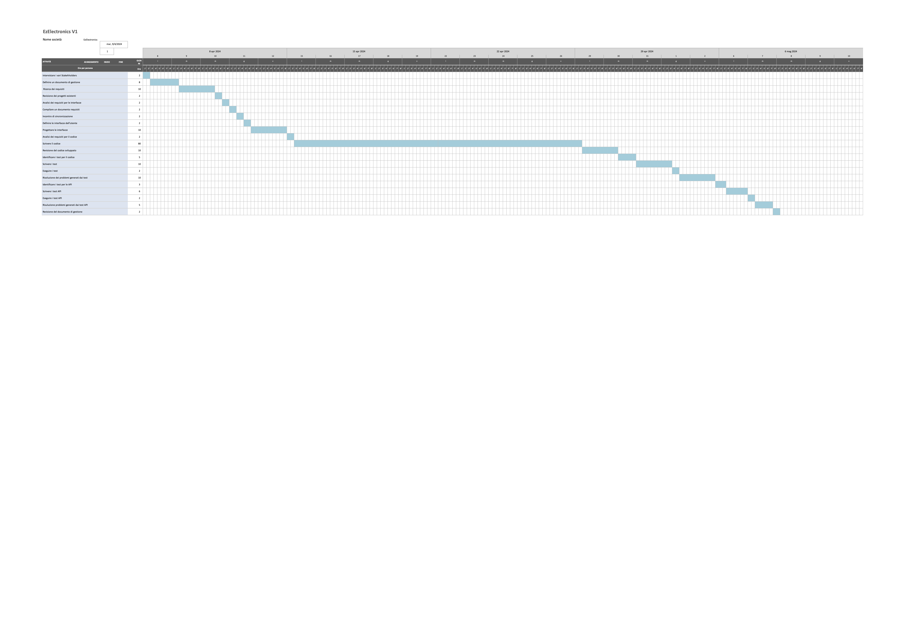

# Project Estimation - CURRENT
Date: 05/05/2024

Version: V1

# Estimation approach
Consider the EZElectronics  project in CURRENT version (as given by the teachers), assume that you are going to develop the project INDEPENDENT of the deadlines of the course, and from scratch
# Estimate by size
### 
|             | Estimate                        |             
| ----------- | ------------------------------- |  
| NC =  Estimated number of classes to be developed   |              3               |             
|  A = Estimated average size per class, in LOC       |        500                   | 
| S = Estimated size of project, in LOC (= NC * A) | 1500 |
| E = Estimated effort, in person hours (here use productivity 10 LOC per person hour)  |    150h                                  |   
| C = Estimated cost, in euro (here use 1 person hour cost = 30 euro) | 4500 | 
| Estimated calendar time, in calendar weeks (Assume team of 4 people, 8 hours per day, 5 days per week) |      0.937 settimana          |               

# Estimate by product decomposition
### 
|         component name    | Estimated effort (person hours)   |             
| ----------- | ------------------------------- | 
| Requirement Document    | 25 | 
| GUI prototype | 15 | 
| Design document | 5 | 
| Code | 100 | 
| Unit tests | 15 | 
| Api tests | 10 |
| Management documents  | 5 | 

# Estimate by activity decomposition
### 
| Activity name                               | Estimated effort (person hours) |
|----------------------------------------|----------------------------------|
| Intervistare i vari Stakeholders | 2 |
| Definire un documento di gestione | 8 |
| Ricerca dei requisiti | 10 |
| Revisione dei progetti esistenti | 2 |
| Analisi dei requisiti per le interfacce| 2 |
| Compilare un documento requisiti | 2 |
| Incontro di sincronizzazione | 2 |
| Definire le interfacce dell'utente | 2 |
| Progettare le interfacce | 10 |
| Analisi dei requisiti per il codice | 2 |
| Scrivere il codice | 80 |
| Revisione del codice sviluppato| 10 |
| Identificare i test per il codice |5|
| Scrivere i test |10|
| Eseguire i test | 2 |
| Risoluzione dei problemi generati dai test | 10 |
| Identificare i test per le API | 3 |
| Scrivere i test API | 6 |
| Eseguire i test API | 2 |
| Risuluzione problemi generati dai test API | 5 |
| Revisione del documento di gestione | 2 |

###
### Gantt Diagram
File pdf: [Gantt Diagram V1](diagrammi/v1/gantt_diagram_v1.pdf)

File xlsx: [Gantt Diagram V1](diagrammi/v1/gantt_diagram_v1.xlsx)

# Summary

Report here the results of the three estimation approaches. The  estimates may differ. Discuss here the possible reasons for the difference

|             | Estimated effort                        |   Estimated duration |          
| ----------- | ------------------------------- | ---------------|
| estimate by size | 150 | 0.937 settimane|
| estimate by product decomposition | 175 | 1.094 settimane |
| estimate by activity decomposition | 177 | 1.106 settimane|

Le tre stime si differenziano nel numero di ore, per via dell'approccio che viene impiegato durante la stima. 

Il primo metodo, riguardante solamente la dimensione del codice, è il più approssimativo perché non scompone le varie fasi di programmazione. Infatti immaginando 500 righe per classe, quindi 1500 totali, si stima un numero di ore pari a 150.

Il secondo approccio scompone il monte ore più nel dettaglio, offrendo una visione più specifica della suddivisione oraria in base alla difficoltà dei task. Con questo tipo di stima si è arrivati ad immaginare 175 person hour.

L'ultimo approccio è il più dettagliato in quanto scompone per attività, questo ci permette di dividere nelle varie fasi dello sviluppo. In questo modo si giunge ad una somma di ore maggiore (183 person hour) derivata dalla maggiore necessità della descrizione dei compiti. 

Si sottolinea che le ore tengono conto di un margine temporale ragionevole all'oscillare dell'efficienza umana. Scendendo maggiormente nel dettaglio il monte ore di conseguenza aumenta.

