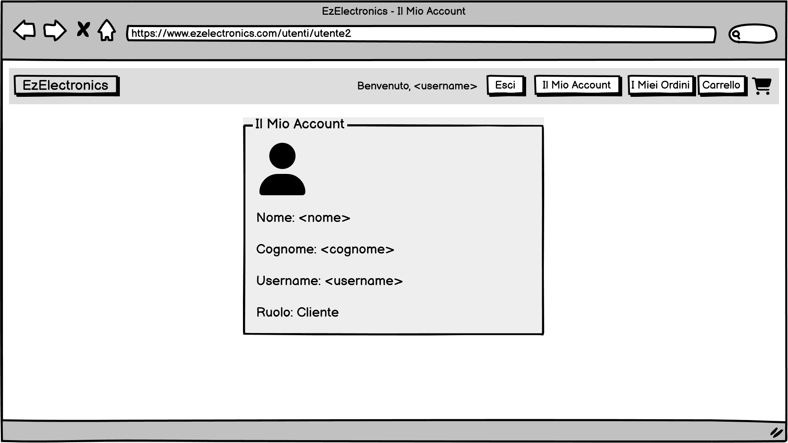

# Graphical User Interface Prototype - CURRENT

Authors: Group ita-49

Date: 05/05/2025

Version: V1

## GUI Interattiva
Il prototipo dell'interfaccia grafica è interamente navigabile tramite il file pdf: [EzElectronics_GUI_V1](gui/v1/EzElectronics_GUI_V1.pdf).

## Screenshot dell'interfaccia grafica
Di seguito sono riportati gli screenshot di tutte le schermate del prototipo dell'interfaccia grafica.

### Homepage

### Accesso 

### Registrazione

### Visualizzazione prodotto

### Manager
#### Manager: Homepage

#### Manager: Dettagli Account

#### Manager: Prodotto

#### Manager: Gestione prodotto

#### Manager: Aggiunta

#### Manager: Aggiunta di un prodotto

#### Manager: Aggiunta di più prodotti dello stesso modello

### Cliente
#### Cliente: Homepage

#### Cliente: Dettagli Account

#### Cliente: Storico ordini

#### Cliente: Prodotto

#### Cliente: Carrello

#### Cliente: Carrello vuoto
