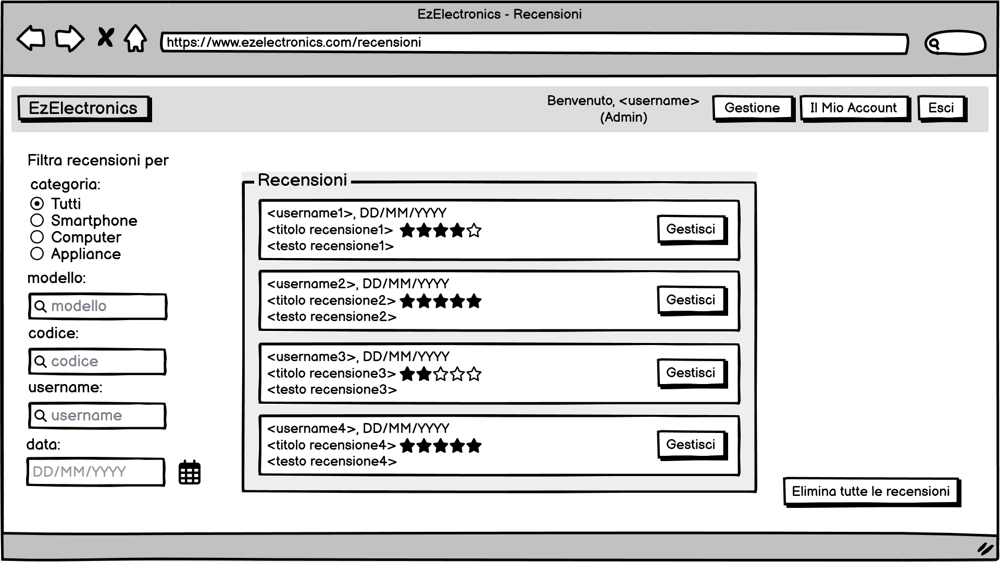
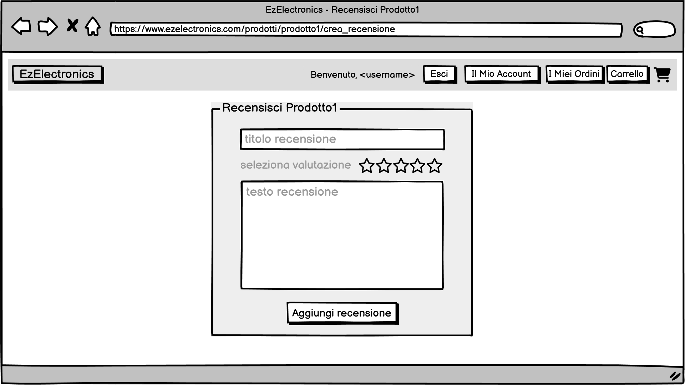

# Graphical User Interface Prototype - CURRENT

Authors: Group ita-49

Date: 05/05/2025

Version: V2

## GUI Interattiva
Il prototipo dell'interfaccia grafica è interamente navigabile tramite il file pdf: [EzElectronics_GUI_V2](gui/v2/EzElectronics_GUI_V2.pdf).

## Screenshot dell'interfaccia grafica
Di seguito sono riportati gli screenshot di tutte le schermate del prototipo dell'interfaccia grafica.

### Homepage

### Accesso 

### Registrazione

### Visualizzazione prodotto

### Visualizzazione recensione di un prodotto

### Admin
#### Admin: Homepage

#### Admin: Il mio account

#### Admin: Dashboard di gestione

#### Admin: Gestione utenti

#### Admin: Gestione prodotti

#### Admin: Creazione account

#### Admin: Aggiunta prodotti

#### Admin: Gestione prodotto

#### Admin: Modifica prodotto

#### Admin: Visualizzazione prodotto

#### Admin: Visualizzazione recensione

#### Admin: Visualizzazione recensioni di un prodotto

#### Admin: Modifica recensione di un prodotto

#### Admin: Visualizzazione di tutte le recensioni

#### Admin: Visualizzazione carrelli

#### Admin: il mio account

#### Admin: Modifica account

### Manager
#### Manager: Homepage

#### Manager: Il mio account

#### Manager: Modifica account

#### Manager: Dashboard di gestione

#### Manager: Creazione account manager

#### Manager: Visualizzazione carrelli confermati

#### Manager: Visualizzazione prodotto

#### Manager: Gestione prodotto

#### Manager: Modifica prodotto

#### Manager: Aggiunta prodotti

#### Manager: Visualizzazione di tutte le recensioni

#### Manager: Visualizzazione recensioni di un prodotto

#### Manager: Visualizzazione recensione

### Cliente
#### Cliente: Homepage

#### Cliente: Il mio account

#### Cliente: Modifica account

#### Cliente: Storico ordini

#### Cliente: Visualizzazione prodotto

#### Cliente: Visualizzazione di una recensione

#### Cliente: Visualizzazione di una propria recensione

#### Cliente: Visualizzazione delle proprie recensioni

#### Cliente: Creazione recensione

#### Cliente: Modifica di una propria recensione

#### Cliente: Visualizzazione carrello

#### Cliente: Visualizzazione carrello vuoto

#### Cliente: Checkout ordine parte 1 - dati di pagamento

#### Cliente: Checkout ordine parte 2 - dati di spedizione 

#### Cliente: Checkout ordine parte 3 - conferma

### Errori
#### Schermata di errore: pagina inesistente

#### Schermata di errore: non si hanno i permessi per accedere
