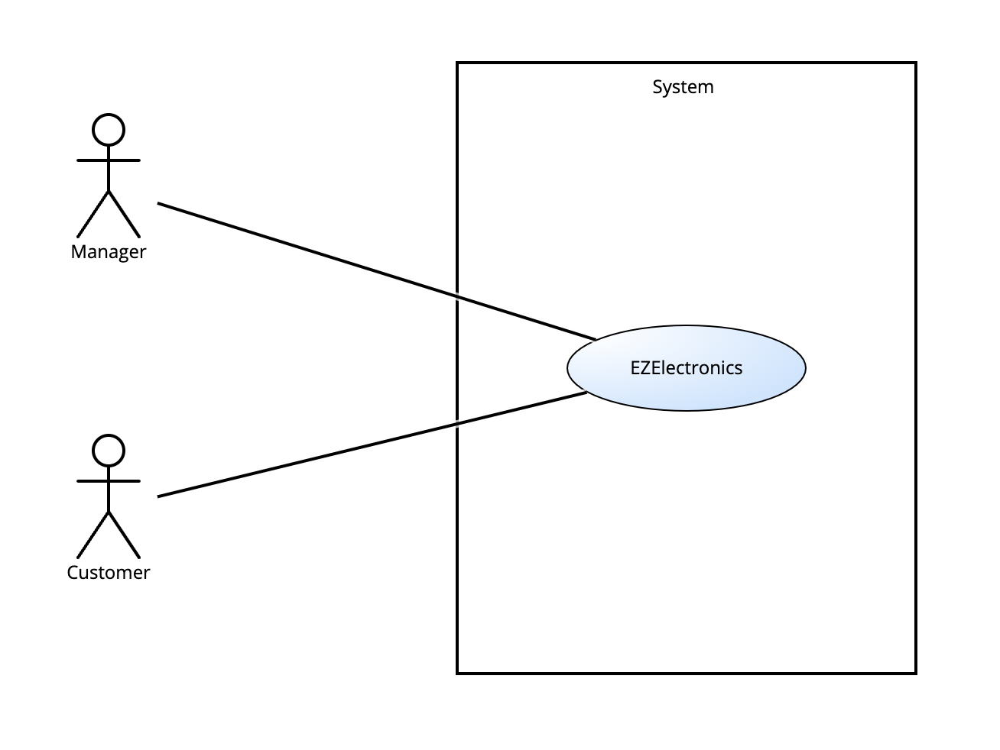
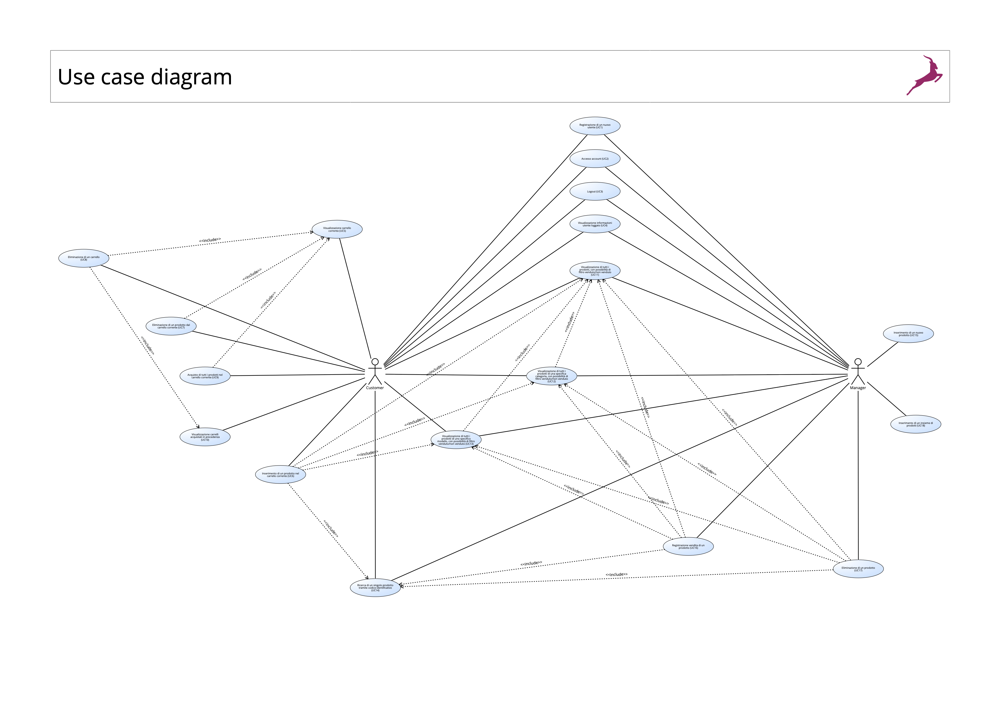
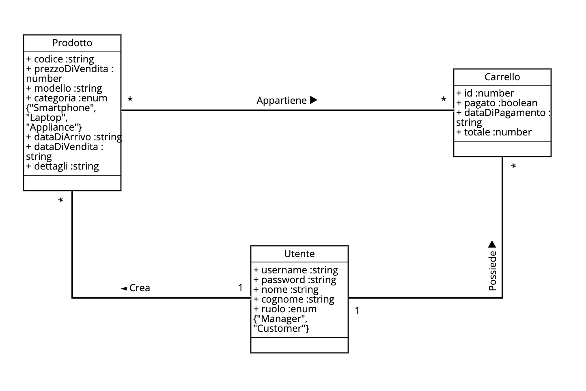
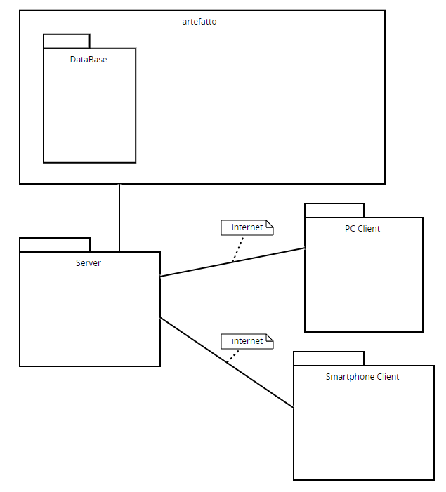

# Requirements Document - current EZElectronics

Date: 05/05/2024

Version: V1 - description of EZElectronics in CURRENT form (as received by teachers)

| Version number | Change |
| :------------: | :----: |
|       V1       |  versione definitiva v1 |

# Contents

- [Requirements Document - current EZElectronics](#requirements-document---current-ezelectronics)
- [Contents](#contents)
- [Informal description](#informal-description)
- [Stakeholders](#stakeholders)
- [Context Diagram and interfaces](#context-diagram-and-interfaces)
  - [Context Diagram](#context-diagram)
  - [Interfaces](#interfaces)
- [Stories and personas](#stories-and-personas)
- [Functional and non functional requirements](#functional-and-non-functional-requirements)
  - [Functional Requirements](#functional-requirements)
   -[Table of rights](#table-of-rights)
  - [Non Functional Requirements](#non-functional-requirements)
- [Use case diagram and use cases](#use-case-diagram-and-use-cases)
  - [Use case diagram](#use-case-diagram)
    - [Use case 1: Registrazione di un nuovo utente (UC1)](#use-case-1-uc1)
      - [Scenario 1.1](#scenario-11)
      - [Scenario 1.2](#scenario-12)
    - [Use case 2: Accesso account (UC2)](#use-case-2-uc2)
      - [Scenario 2.1](#scenario-21)
      - [Scenario 2.2](#scenario-22)
      - [Scenario 2.3](#scenario-23)
    - [Use case 3: Logout (UC3)](#use-case-3-uc3)
      - [Scenario 3.1](#scenario-21)
    - [Use case 4: Visualizzazione informazioni utente loggato (UC4)](#use-case-4-uc4)
      - [Scenario 4.1](#scenario-41)
    - [Use case 5: Visualizzazione carrello corrente (UC5)](#use-case-5-uc5)
      - [Scenario 5.1](#scenario-51)
    - [Use case 6: Inserimento di un prodotto nel carrello corrente (UC6)](#use-case-6-uc6)
      - [Scenario 6.1](#scenario-61)
      - [Scenario 6.2](#scenario-62)
      - [Scenario 6.3](#scenario-63)
      - [Scenario 6.4](#scenario-64)
    - [Use case 7: Eliminazione di un prodotto dal carrello corrente (UC7)](#use-case-7-uc7)
      - [Scenario 7.1](#scenario-71)
      - [Scenario 7.2](#scenario-72)
      - [Scenario 7.3](#scenario-73)
      - [Scenario 7.4](#scenario-74)
      - [Scenario 7.5](#scenario-75)
      - [Scenario 7.6](#scenario-76)
    - [Use case 8: Eliminazione di un carrello (UC8)](#use-case-8-uc8)
      - [Scenario 8.1](#scenario-81)
      - [Scenario 8.2](#scenario-82)
      - [Scenario 8.3](#scenario-83)
    - [Use case 9: Acquisto di tutti i prodotti nel carrello corrente (UC9)](#use-case-9-uc9)
      - [Scenario 9.1](#scenario-91)
      - [Scenario 9.2](#scenario-92)
      - [Scenario 9.3](#scenario-93)
    - [Use case 10: Visualizzazione carrelli acquistati in precedenza (UC10)](#use-case-10-uc10)
      - [Scenario 10.1](#scenario-101)
    - [Use case 11: Visualizzazione di tutti i prodotti, con possibilità di filtro venduto/non venduto (UC11)](#use-case-11-uc11)
      - [Scenario 11.1](#scenario-111)
      - [Scenario 11.2](#scenario-112)
      - [Scenario 11.3](#scenario-113)
    - [Use case 12: Visualizzazione di tutti i prodotti di una specifica categoria, con possibilità di filtro venduto/non venduto (UC12)](#use-case-12-uc12)
      - [Scenario 12.1](#scenario-121)
      - [Scenario 12.2](#scenario-122)
    - [Use case 13: Visualizzazione di tutti i prodotti di uno specifico modello, con possibilità di filtro venduto/non venduto (UC13)](#use-case-13-uc13)
      - [Scenario 13.1](#scenario-131)
      - [Scenario 13.2](#scenario-132)
    - [Use case 14: Ricerca di un singolo prodotto tramite codice identificativo (UC14)](#use-case-14-uc14)
      - [Scenario 14.1](#scenario-141)
      - [Scenario 14.2](#scenario-142)
    - [Use case 15: Inserimento di un nuovo prodotto (UC15)](#use-case-15-uc15)
      - [Scenario 15.1](#scenario-151)
      - [Scenario 15.2](#scenario-152)
      - [Scenario 15.3](#scenario-153)
      - [Scenario 15.4](#scenario-154)
      - [Scenario 15.5](#scenario-155)
      - [Scenario 15.6](#scenario-156)
      - [Scenario 15.7](#scenario-157)
    - [Use case 16: Registrazione vendita di un prodotto (UC16)](#use-case-16-uc16)
      - [Scenario 16.1](#scenario-161)
      - [Scenario 16.2](#scenario-162)
      - [Scenario 16.3](#scenario-163)
      - [Scenario 16.4](#scenario-164)
    - [Use case 17: Eliminazione di un prodotto (UC17)](#use-case-17-uc17)
      - [Scenario 17.1](#scenario-171)
      - [Scenario 17.2](#scenario-172)
    - [Use case 18: Inserimento di un insieme di prodotti (UC18)](#use-case-18-uc18)
      - [Scenario 18.1](#scenario-181)
      - [Scenario 18.2](#scenario-182)
      - [Scenario 18.3](#scenario-183)
      - [Scenario 18.4](#scenario-184)
      - [Scenario 18.5](#scenario-185)
- [Glossary](#glossary)
- [System Design](#system-design)
- [Deployment Diagram](#deployment-diagram)

# Informal description

EZElectronics (read EaSy Electronics) is a software application designed to help managers of electronics stores to manage their products and offer them to customers through a dedicated website. Managers can assess the available products, record new ones, and confirm purchases. Customers can see available products, add them to a cart and see the history of their past purchases.

## IMPORTANTE!

Nella stesura del documento abbiamo fatto riferimento ai commenti inseriti nel codice del progetto, per quanto concerne la visibilità dei metodi, l'eventuale presenza di metodi disponibili solo in ambiente di test ecc. 

## INFORMAZIONI DI CONTESTO

Abbiamo interpretato le informazioni fornite come segue. Noi ci poniamo come sviluppatori di un'applicazione web da distribuire a diverse aziende, ciascuna delle quali intrattiene dei rapporti con clienti. Ogni azienda ha la sua versione del software, un proprio database in cui i manager di quell'azienda possono inserire i prodotti e i clienti possono fare acquisti.

Il software non gestisce la spedizione dei prodotti, che avviene secondo modalità concordate tra manager e customer, esternamente all'applicativo. Anche il pagamento è gestito esternamente e pertanto la conferma di un carrello non coincide con la registrazione della vendita da parte del manager.

# Stakeholders

| Stakeholder name | Description |
| :--------------: | :---------: |
| Manager | Gestore del negozio di elettronica. Gestisce l'inserimento e la cancellazione dei prodotti e le operazioni di vendita. |
| Customer | Consumatore che visita il sito web. Visualizza i prodotti, gestisce il carrello ed acquista. |

# Context Diagram and interfaces

## Context Diagram

## Interfaces

|   Actor   | Logical Interface | Physical Interface |
| :-------: | :---------------: | :----------------: |
| Manager   | GUI Manager       | PC/Internet        |
| Customer  | GUI Customer      | PC/Smartphone      |

# Stories and personas

- Luigi - Manager (40 anni)

  Lui può creare un account, accedere ad un account esistente o effettuare logout. Può visualizzare le proprie informazioni. Può registrare uno o più prodotti di uno stesso modello, smarcarli come venduti o cancellarli. Può visualizzare tutti i prodotti, filtrando eventualmente quelli già venduti o non ancora venduti e/o filtrando per categoria o modello. Può cercare un prodotto per codice identificativo.

  Obiettivi: Offrire e mantenere un servizio di qualità per i clienti e fornire un catalogo aggiornato.
  
- Sara - customer (25 anni)
  Lei può creare un account, accedere ad un account esistente o effettuare logout. Può visualizzare le proprie informazioni. Può visualizzare tutti i prodotti, filtrando eventualmente quelli già venduti o non ancora venduti e/o filtrando per categoria o modello. Può cercare un prodotto per codice identificativo. Può gestire un carrello di prodotti: può visualizzarlo, può aggiungere o rimuovere un singolo prodotto, svuotare l'intero carrello e confermare l'acquisto dei prodotti. Può visualizzare la lista degli ordini effettuati.

  Obiettivi: acquistare prodotti in modo semplice.

# Functional and non functional requirements

## Functional Requirements

|  ID   | Description |
| :---: | :---------: |
|  **FR1**  |      **Autenticazione e gestione utente**    |
|FR1.1| Login|
|FR1.2| Logout|
|FR1.3| Visualizzazione informazioni utente loggato|
|FR1.4| Registrazione di un nuovo utente|
| --- | --------- |
|**FR2**| **Gestione dei prodotti**|
|FR2.1| Inserimento di un nuovo prodotto |
|FR2.2| Inserimento di un insieme di prodotti|
|FR2.3| Registrazione vendita di un prodotto|
|FR2.4| Visualizzazione di tutti i prodotti, con possibilità di filtro venduto/non venduto|
|FR2.5| Ricerca di un singolo prodotto tramite codice identificativo|
|FR2.6| Visualizzazione di tutti i prodotti di una specifica categoria, con possibilità di filtro venduto/non venduto|
|FR2.7| Visualizzazione di tutti i prodotti di uno specifico modello, con possibilità di filtro venduto/non venduto|
|FR2.8| Eliminazione di un prodotto|
| --- | --------- |
|**FR3**| **Gestione carrello utente**|
|FR3.1| Visualizzazione carrello corrente|
|FR3.2| Inserimento di un prodotto nel carrello corrente|
|FR3.3| Acquisto di tutti i prodotti nel carrello corrente|
|FR3.4| Visualizzazione carrelli acquistati in precedenza |
|FR3.5| Eliminazione di un prodotto dal carrello corrente|
|FR3.6| Eliminazione di un carrello|

### Table of rights
|Function | Customer                                |Manager      |
| :-----: | :--------------------------------: | :---------: | 
| **FR1 Gestione accesso** | -------               | -------     |
| FR1.1 | x            | x   |
| FR1.2 | x            | x   |
| FR1.3 | x            | x   |
| FR1.4 | x            | x   |
| **FR2 Gestione dei prodotti** | -------               | -------     |
| FR2.1 |              | x   |
| FR2.2 |              | x   |
| FR2.3 |              | x   |
| FR2.4 | x            | x   |
| FR2.5 | x            | x   |
| FR2.6 | x            | x   |
| FR2.7 | x            | x   |
| FR2.8 |              | x   |
| **FR3 Gestione carrello utente** | -------               | -------     |
| FR3.1 | x            |     |
| FR3.2 | x            |     |
| FR3.3 | x            |     |
| FR3.4 | x            |     |
| FR3.5 | x            |     |
| FR3.6 | x            |     |

## Non Functional Requirements

|   ID    | Type (efficiency, reliability, ..) | Description | Refers to |
| :-----: | :--------------------------------: | :---------: | :-------: |
|  NFR1   | Efficienza | Il sistema deve garantire un tempo di risposta di massimo un secondo. Deve garantire un carico inferiore al 25% delle risorse di cpu. | FR1, FR2, FR3 |
|  NFR2   | Affidabilità | Gli utenti non devono riferire più di un bug all'anno ciascuno. Il sistema deve essere disponibile per il 95% del tempo operativo. Il 100% degli errori devone essere espressi nel modo corretto fornendo messaggi e codici specifici. | FR1, FR2, FR3 |
|  NFR3   | Sicurezza | Protezione dei dati sensibili degli utenti. Soltanto un utente customer può accedere alla funzionalità di gestione carrello. Soltanto un utente manager può registrare il prodotto, la sua vendita o cancellarlo. | FR1, FR2, FR3 |
|  NFR4   | Usabilità | Gli utenti non devono imparare a usare il sito. Facilità d'uso: tempo d'apprendimento tendente a 0. Accessibilità: il sistema deve aderire al 100% degli standard web per l'accessibilità | FR1, FR2, FR3 |
|  NFR5   | Scalabilità | Gestione di un aumento del carico utente senza perdita di prestazioni. | FR1, FR2, FR3 |

# Use case diagram and use cases

## Use case diagram

### Use case 1: Registrazione di un nuovo utente (UC1)

| Actors Involved  |  Utente   |
| :--------------: | :------------------------------------------------------------------: |
|   Precondition   | L'utente non deve essere già registrato né loggato.                              |
|  Post condition  | L'utente è registrato.                                   |
| Nominal Scenario | Scenario 1.1     |
|     Variants     |         Nessuna        |
|    Exceptions    | Scenario 1.2 |

##### Scenario 1.1

|  Scenario 1.1  |  Creazione account con successo |
| :------------: | :---------------------------------------------------------------------------------------------------: |
|  Precondition  | L'utente non deve essere già registrato né loggato.                                                               |
| Post condition | L'utente è registrato.                                                                 |
|     Step#      |      Description         |
|       1        | L'utente chiede di effettuare la registrazione. |
|       2        | Il sistema chiede l'inserimento dei dati (username, nome, cognome, password, ruolo).                        |
|       3        | L'utente inserisce i dati richiesti.                     |
|       4        | Il sistema verifica i dati inseriti: l'username non esiste già.                              |
|       5        | Il sistema registra l'utente.                              |

##### Scenario 1.2
|  Scenario 1.2  |  Username già esistente |
| :------------: | :---------------------------------------------------------------------------------------------------: |
|  Precondition  | L'utente non deve essere già registrato né loggato.                                                               |
| Post condition | Nessuna.        |
|     Step#      |                          Description         |
|       1        | L'utente chiede di effettuare la registrazione. |
|       2        | Il sistema chiede l'inserimento dei dati (username, nome, cognome, password, ruolo).                        |
|       3        | L'utente inserisce i dati richiesti.                     |
|       4        | Il sistema verifica i dati inseriti: esiste già un account con lo username fornito.                          |
|       5        | Il sistema avvisa l'utente con un messaggio di errore.  |

### Use case 2: Accesso account (UC2)
| Actors Involved | Utente   |
| :--------------: | :-------------------------------------------------------------------------------------------------: |
|   Precondition   | L'utente è già registrato ma non è loggato. |
|  Post condition  | L'utente è loggato.  |
| Nominal Scenario | Scenario 2.1   |
|     Variants     |    Nessuna          |
|    Exceptions    | Scenario 2.2, Scenario 2.3  |

##### Scenario 2.1
|  Scenario 2.1  |  Accesso all'account con successo  |
| :------------: | :------------------------------------------------------------------------: |
|  Precondition  | L'utente è già registrato ma non è loggato.      |
| Post condition | L'utente è loggato.    |
|     Step#      |     Description   |
|       1        | L'utente chiede di effettuare il login.  |
|       2        | Il sistema richiede l'inserimento di username e password.              |
|       3        | L'utente inserisce i dati richiesti.                               |
|       4        | Il sistema verifica i dati inseriti: l'username esiste e la password è corretta.                                        |
|       5       | Il sistema autentica l'utente.                                             |

##### Scenario 2.2
|  Scenario 2.2  |    Password errata      |
| :------------: | :------------------------------------------------------------------------: |
|  Precondition  | L'utente è già registrato ma non è loggato.    |
| Post condition | Nessuna.   |
|     Step#      |     Description     |
|       1        | L'utente chiede di effettuare il login.  |
|       2        | Il sistema richiede l'inserimento di username e password.              |
|       3        | L'utente inserisce i dati richiesti.                               |
|       4        | Il sistema verifica i dati inseriti: la password non corrisponde a quella registrata per l'utente.                                        |
|       5       | Il sistema mostra un messaggio di errore. |    

##### Scenario 2.3
|  Scenario 2.3  |    Username non esistente      |
| :------------: | :------------------------------------------------------------------------: |
|  Precondition  | L'utente non è registrato e non è loggato.    |
| Post condition | Nessuna.      |
|     Step#      |     Description     |
|       1        | L'utente chiede di effettuare il login.  |
|       2        | Il sistema richiede l'inserimento di username e password.              |
|       3        | L'utente inserisce i dati richiesti.                               |
|       4        | Il sistema verifica i dati inseriti: l'username è inesistente.                   |
|       5       | Il sistema mostra un messaggio di errore. |    

### Use case 3: Logout (UC3)
| Actors Involved |   Utente   |
| :--------------: | :------------------------------------------------------------------: |
|   Precondition   | L'utente è loggato.    |
|  Post condition  | L'utente non è loggato.     |
| Nominal Scenario | Scenario 3.1   |
|     Variants     |                     Nessuna variante.           |
|    Exceptions    | Nessuna eccezione.                        |

##### Scenario 3.1
|  Scenario 3.1  |     Logout           |
| :------------: | :------------------------------------------------------------------------: |
|  Precondition  | L'utente è loggato.       |
| Post condition | L'utente non è loggato.     |
|     Step#      |   Description       |
|       1        | L'utente chiede di disconnettersi.   |
|       2        | Il sistema effettua il logout.    |

### Use case 4: Visualizzazione informazioni utente loggato (UC4)
| Actors Involved |   Utente    |
| :--------------: | :------------------------------------------------------------------: |
|   Precondition   | L'utente è loggato.   |
|  Post condition  | Nessuna.     |
| Nominal Scenario | Scenario 4.1        |
|     Variants     |                     Nessuna                                  |
|    Exceptions    | Nessuna                 |

##### Scenario 4.1
|  Scenario 4.1  |   Visualizzazione dei dati dell'account     |
| :------------: | :------------------------------------------------------------------------: |
|  Precondition  | L'utente è loggato.    |
| Post condition | Nessuna.     |
|     Step#      |                                Description             |
|       1         | L'utente chiede di visualizzare i dati del suo account.                   |
|       2        | Il sistema mostra i dati dell'utente.                                       |

### Use case 5: Visualizzazione carrello corrente (UC5)
| Actors Involved |   Customer           |
| :--------------: | :------------------------------------------------------------------: |
|   Precondition   | Il customer è loggato.               |
|  Post condition  | Nessuna.          |
| Nominal Scenario | Scenario 5.1   |
|     Variants     |         Nessuna.           |
|    Exceptions    | Nessuna.                  |

##### Scenario 5.1
|  Scenario 5.1  | Visualizzazione carrello corrente   |
| :------------: | :------------------------------------------------------------------------: |
|  Precondition  | Il customer è loggato.         |
| Post condition | Nessuna.         |
|     Step#      | Description        |
|       1        | Il customer chiede di visualizzare il carrello corrente.                     | 
|       2        | Il sistema mostra i prodotti presenti nel carrello corrente del customer loggato.  |

### Use case 6: Inserimento di un prodotto nel carrello corrente (UC6)
| Actors Involved |   Customer                                                            |
| :--------------: | :------------------------------------------------------------------: |
|   Precondition   | Il customer è loggato AND (UC11 OR UC12 OR UC13 OR UC14)                  |
|  Post condition  | Il prodotto è stato aggiunto al carrello.                             |
| Nominal Scenario | Scenario 6.1        |
|     Variants     | Nessuna.              |
|    Exceptions    | Scenario 6.2, Scenario 6.3, Scenario 6.4      |

##### Scenario 6.1
|  Scenario 6.1  |  Inserimento con successo  |
| :------------: | :------------------------------------------------------------------------: |
|  Precondition  | Il customer è loggato AND (UC11 OR UC12 OR UC13 OR UC14)                           |
| Post condition | Il prodotto è stato aggiunto al carrello.                                   |
|     Step#      |                                Description                                 |
|       1        | Il customer seleziona un prodotto.                                             |
|       2        | Il customer chiede di aggiungere il prodotto selezionato al carrello.              |
|       3        | Il sistema verifica il prodotto: l'id del prodotto è valido, il prodotto non è già nel carrello e non è ancora stato venduto.  |
|       4        | Il sistema aggiunge il prodotto al carrello.                                |

##### Scenario 6.2
|  Scenario 6.2  |  Id Prodotto non valido  |
| :------------: | :------------------------------------------------------------------------: |
|  Precondition  | Il customer è loggato AND (UC11 OR UC12 OR UC13 OR UC14)           |
| Post condition | Nessuna.                              |
|     Step#      |                                Description                                 |
|       1        | Il customer seleziona un prodotto.                                             |
|       2        | Il customer chiede di aggiungere il prodotto selezionato al carrello.              |
|       3        | Il sistema verifica il prodotto: l'id del prodotto non è valido.  |
|       4        | Il sistema mostra un messaggio di errore.    |

##### Scenario 6.3
|  Scenario 6.3  |  Prodotto già nel carrello  |
| :------------: | :------------------------------------------------------------------------: |
|  Precondition  | Il customer è loggato AND (UC11 OR UC12 OR UC13 OR UC14)             |
| Post condition | Nessuna.                               |
|     Step#      |                                Description                                 |
|       1        | Il customer seleziona un prodotto.                                             |
|       2        | Il customer chiede di aggiungere il prodotto selezionato al carrello.              |
|       3        | Il sistema verifica il prodotto: il prodotto è già nel carrello.  |
|       4        | Il sistema mostra un messaggio di errore.    |

##### Scenario 6.4
|  Scenario 6.4  |  Prodotto già venduto |
| :------------: | :------------------------------------------------------------------------: |
|  Precondition  | Il customer è loggato AND (UC11 OR UC12 OR UC13 OR UC14)        |
| Post condition | Nessuna.                                |
|     Step#      |                                Description                                 |
|       1        | Il customer seleziona un prodotto.                                             |
|       2        | Il customer chiede di aggiungere il prodotto selezionato al carrello.              |
|       3        | Il sistema verifica il prodotto: il prodotto è già stato venduto.  |
|       4        | Il sistema mostra un messaggio di errore.    |

### Use case 7: Eliminazione di un prodotto dal carrello corrente (UC7)
| Actors Involved |   Customer                                                            |
| :--------------: | :------------------------------------------------------------------: |
|   Precondition   | Il customer è loggato AND UC5.                                       |
|  Post condition  | Il prodotto è stato rimosso dal carrello.                             |
| Nominal Scenario | Scenario 7.1               |
|     Variants     |                     nessuna variante                                 |
|    Exceptions    | Scenario 7.2, Scenario 7.3, Scenario 7.4, Scenario 7.5, Scenario 7.6     |

##### Scenario 7.1
|  Scenario 7.1  |  Rimozione con successo                           |
| :------------: | :------------------------------------------------------------------------: |
|  Precondition  | Il customer è loggato AND UC5.                                  |
| Post condition | Il prodotto è stato rimosso dal carrello.                                   |
|     Step#      |                                Description                                 |
|       1        | Il customer seleziona un prodotto.                                             |
|       2        | Il customer chiede di rimuovere il prodotto dal carrello.          |
|       3        | Il sistema verifica il carrello: l'id del carrello è valido, il carrello appartiene al customer loggato e non è ancora stato confermato. |
|       4        | Il sistema verifica il prodotto: l'id del prodotto è valido, il prodotto è nel carrello. |
|       5        | Il sistema rimuove il prodotto dal carrello.                                |

##### Scenario 7.2
|  Scenario 7.2  |  Id carrello non valido                        |
| :------------: | :------------------------------------------------------------------------: |
|  Precondition  | Il customer è loggato AND UC5.                                  |
| Post condition | Nessuna.                               |
|     Step#      |                                Description                                 |
|       1        | Il customer seleziona un prodotto.                                             |
|       2        | Il customer chiede di rimuovere il prodotto dal carrello.          |
|       3        | Il sistema verifica il carrello: l'id del carrello non è valido. |
|       4        | Il sistema mostra un messaggio di errore.    |     

##### Scenario 7.3
|  Scenario 7.3  |  Carrello di un altro customer             |
| :------------: | :------------------------------------------------------------------------: |
|  Precondition  | Il customer è loggato AND UC5.                                  |
| Post condition | Nessuna.                               |
|     Step#      |                                Description                                 |
|       1        | Il customer seleziona un prodotto.                                             |
|       2        | Il customer chiede di rimuovere il prodotto dal carrello.          |
|       3        | Il sistema verifica il carrello: il carrello non appartiene al customer loggato. |
|       4        | Il sistema mostra un messaggio di errore.    |     

##### Scenario 7.4
|  Scenario 7.4  |  Carrello già confermato             |
| :------------: | :------------------------------------------------------------------------: |
|  Precondition  | Il customer è loggato AND UC5.                                  |
| Post condition | Nessuna.                                 |
|     Step#      |                                Description                                 |
|       1        | Il customer seleziona un prodotto.                                             |
|       2        | Il customer chiede di rimuovere il prodotto dal carrello.          |
|       3        | Il sistema verifica il carrello: il carrello è già stato confermato. |
|       4        | Il sistema mostra un messaggio di errore.    |     

##### Scenario 7.5
|  Scenario 7.5  |  Id prodotto non valido         |
| :------------: | :------------------------------------------------------------------------: |
|  Precondition  | Il customer è loggato AND UC5.                                  |
| Post condition | Nessuna.                      |
|     Step#      |                                Description                                 |
|       1        | Il customer seleziona un prodotto.                                             |
|       2        | Il customer chiede di rimuovere il prodotto dal carrello.          |
|       3        | Il sistema verifica il carrello: l'id del carrello è valido, il carrello appartiene al customer loggato e non è ancora stato confermato. |
|       4        | Il sistema verifica il prodotto: l'id del prodotto non è valido. |
|       5        | Il sistema mostra un messaggio di errore.                               |

##### Scenario 7.6
|  Scenario 7.6  |  Prodotto non nel carrello         |
| :------------: | :------------------------------------------------------------------------: |
|  Precondition  | Il customer è loggato AND UC5.                                  |
| Post condition | Nessuna.                          |
|     Step#      |                                Description                                 |
|       1        | Il customer seleziona un prodotto.                                             |
|       2        | Il customer chiede di rimuovere il prodotto dal carrello.          |
|       3        | Il sistema verifica il carrello: l'id del carrello è valido, il carrello appartiene al customer loggato e non è ancora stato confermato. |
|       4        | Il sistema verifica il prodotto: il prodotto non è nel carrello. |
|       5        | Il sistema mostra un messaggio di errore.                               |

### Use case 8: Eliminazione di un carrello (UC8)
| Actors Involved |   Customer                                                            |
| :--------------: | :------------------------------------------------------------------: |
|   Precondition   | Il customer è loggato AND (UC5 OR UC10)                                             |
|  Post condition  | Il carrello è stato eliminato.            |
| Nominal Scenario | Scenario 8.1             |
|     Variants     |                     Nessuna variante.                                 |
|    Exceptions    | Scenario 8.2, Scenario 8.3          |

##### Scenario 8.1
|  Scenario 8.1  | Rimozione di tutti i prodotti da un carrello con successo                                                                           |
| :------------: | :------------------------------------------------------------------------: |
|  Precondition  | Il customer è loggato AND (UC5 OR UC10)                                                |
| Post condition | Il carrello è vuoto.                               |
|     Step#      |                                Description                                 |
|       1        | Il customer seleziona il carrello che intende rimuovere. |
|       2        | Il customer chiede di rimuovere il carrello selezionato.    |
|       3        | Il sistema verifica il carrello: l'id del carrello è valido e il carrello appartiene al customer loggato. |
|       4        | Il sistema rimuove il carrello.     |

##### Scenario 8.2
|  Scenario 8.2  | Id del carrello invalido                                           |
| :------------: | :------------------------------------------------------------------------: |
|  Precondition  | Il customer è loggato AND (UC5 OR UC10)                                                |
| Post condition | Nessuna.                |
|     Step#      |                                Description                                 |
|       1        | Il customer seleziona il carrello che intende rimuovere. |
|       2        | Il customer chiede di rimuovere il carrello selezionato.    |
|       3        | Il sistema verifica il carrello: l'id del carrello non è valido. |

##### Scenario 8.3
|  Scenario 8.3  | Carrello di un altro customer    |
| :------------: | :------------------------------------------------------------------------: |
|  Precondition  | Il customer è loggato AND (UC5 OR UC10)                                                |
| Post condition | Nessuna.                              |
|     Step#      |                                Description                                 |
|       1        | Il customer seleziona il carrello che intende rimuovere. |
|       2        | Il customer chiede di rimuovere il carrello non appartiene al customer loggato.    |
|       3        | Il sistema verifica il carrello: l'id del carrello non è valido. |

### Use case 9: Acquisto di tutti i prodotti nel carrello corrente (UC9)
| Actors Involved | Customer                                                            |
| :--------------: | :------------------------------------------------------------------: |
|   Precondition   | Il customer è loggato AND UC5.                                             |
|  Post condition  | Il carrello è confermato.                                 |
| Nominal Scenario | Scenario 9.1                         |
|     Variants     |                     Nessuna variante                                 |
|    Exceptions    | Scenario 9.2         |

##### Scenario 9.1
|  Scenario 9.1  | Conferma del carrello con successo               |
| :------------: | :------------------------------------------------------------------------: |
|  Precondition  | Il customer è loggato AND UC5.                        |
| Post condition | Il carrello è confermato.                                                  |
|     Step#      |                                Description                                 |
|       1        | Il customer chiede di confermare il carrello.                           |
|       2        | Il sistema verifica: il carrello contiene almeno un prodotto.     |
|       3        | Il sistema conferma il carrello.                                           |

##### Scenario 9.2
|  Scenario 9.2  | Carrello vuoto                                     |
| :------------: | :------------------------------------------------------------------------: |
|  Precondition  | Il customer è loggato AND UC5.                                                 |
| Post condition | Nessuna.                                |
|     Step#      |                                Description                                 |
|       1        | Il customer chiede di confermare il carrello.                           |
|       2        | Il sistema verifica: il carrello non contiene nessun prodotto.     |
|       3        | Il sistema mostra un messaggio di errore.                                          |

### Use case 10: Visualizzazione carrelli acquistati in precedenza (UC10)
| Actors Involved | Customer                                                            |
| :--------------: | :------------------------------------------------------------------: |
|   Precondition   | Il customer è loggato.                            |
|  Post condition  | Nessuna.                                                              |
| Nominal Scenario | Scenario 10.1               |
|     Variants     |                     nessuna variante                                 |
|    Exceptions    | Nessuna.                                                              |

##### Scenario 10.1
|  Scenario 10.1 | Visualizzazione ordini effettuati con successo                                                                             |
| :------------: | :------------------------------------------------------------------------: |
|  Precondition  | Il customer è loggato.                                         |
| Post condition | Nessuna.                                                                    |
|     Step#      |                                Description                                 |
|       1        | Il customer chiede di visualizzare la lista degli ordini effettuati.                           |
|       2        | Il sistema mostra la lista degli ordini effettuati.                         |

### Use case 11: Visualizzazione di tutti i prodotti, con possibilità di filtro venduto/non venduto (UC11)
| Actors Involved | Utente                                                   |
| :--------------: | :------------------------------------------------------------------: |
|   Precondition   | L'utente è loggato.                                        |
|  Post condition  | Nessuna                                                              |
| Nominal Scenario | Scenario 11.1                  |
|     Variants     | Scenario 11.2, Scenario 11.3                      |
|    Exceptions    | Nessuna.                              |

##### Scenario 11.1
|  Scenario 11.1 | Visualizzazione non filtrata                            |
| :------------: | :------------------------------------------------------------------------: |
|  Precondition  | L'utente è loggato.                                                     |
| Post condition | Nessuna                                                                    |
|     Step#      |                                Description                                 |
|       1        | L'utente chiede di visualizzare la lista dei prodotti.                                 |
|       2        | Il sistema mostra la lista dei prodotti.                                    |

##### Scenario 11.2
|  Scenario 11.2 | Visualizzazione filtrata per prodotti venduti                                                                           |
| :------------: | :------------------------------------------------------------------------: |
|  Precondition  | L'utente è loggato.                                                                |
| Post condition | Nessuna                                                                    |
|     Step#      |                                Description                                 |
|       1        | L'utente chiede di visualizzare la lista dei prodotti.                                 |
|       2        | Il sistema mostra la lista dei prodotti.                                    |
|       3        | L'utente chiede di filtrare la lista per prodotti venduti.            |
|       4        | Il sistema mostra la lista filtrata.                                        |

##### Scenario 11.3
|  Scenario 11.3 | Visualizzazione filtrata per prodotti non venduti                                                                           |
| :------------: | :------------------------------------------------------------------------: |
|  Precondition  | L'utente è loggato.                                                              |
| Post condition | Nessuna                                                                    |
|     Step#      |                                Description                                 |
|       1        | L'utente chiede di visualizzare la lista dei prodotti.                                 |
|       2        | Il sistema mostra la lista dei prodotti.                                    |
|       3        | L'utente chiede di filtrare la lista per prodotti non venduti.            |
|       4        | Il sistema mostra la lista filtrata.                                        |

### Use case 12: Visualizzazione di tutti i prodotti di una specifica categoria, con possibilità di filtro venduto/non venduto (UC12)
| Actors Involved | Utente                                                   |
| :--------------: | :------------------------------------------------------------------: |
|   Precondition   | L'utente è loggato AND UC11.                                        |
|  Post condition  | Nessuna                                                              |
| Nominal Scenario | Scenario 12.1                  |
|     Variants     | Nessuna.             |
|    Exceptions    | Scenario 12.2                 |

##### Scenario 12.1
|  Scenario 12.1 | Visualizzazione lista filtrata per categoria                                                                           |
| :------------: | :------------------------------------------------------------------------: |
|  Precondition  | L'utente è loggato AND UC11.                                                   |
| Post condition | Nessuna                                                                    |
|     Step#      |                                Description                                 |
|       1        | L'utente chiede di filtrare la lista mostrata per una categoria specifica. |
|       2        | Il sistema verifica: la categoria appartiene all'insieme ("Smartphone", "Laptop", "Appliance").           |
|       3        | Il sistema mostra la lista filtrata.                                        |

##### Scenario 12.2
|  Scenario 12.2 | Categoria inesistente                                        |
| :------------: | :------------------------------------------------------------------------: |
|  Precondition  | L'utente è loggato AND UC11.                                                   |
| Post condition | Nessuna                                                                    |
|     Step#      |                                Description                                 |
|       1        | L'utente chiede di filtrare la lista mostrata per una categoria specifica. |
|       2        | Il sistema verifica: la categoria non appartiene all'insieme ("Smartphone", "Laptop", "Appliance").           |
|       3        | Il sistema mostra un messaggio di errore.                                    |

### Use case 13: Visualizzazione di tutti i prodotti di uno specifico modello, con possibilità di filtro venduto/non venduto (UC13)
| Actors Involved | Utente                                                   |
| :--------------: | :------------------------------------------------------------------: |
|   Precondition   | L'utente è loggato AND UC11.                                        |
|  Post condition  | Nessuna                                                              |
| Nominal Scenario | Scenario 13.1                  |
|     Variants     | Nessuna.             |
|    Exceptions    | Scenario 13.2                 |

##### Scenario 13.1
|  Scenario 13.1 | Visualizzazione lista filtrata per modello                       |
| :------------: | :------------------------------------------------------------------------: |
|  Precondition  | L'utente è loggato AND UC11.                                                   |
| Post condition | Nessuna                                                                    |
|     Step#      |                                Description                                 |
|       1        | L'utente chiede di filtrare la lista mostrata per un modello specifico. |
|       2        | Il sistema verifica: il modello inserito è valido.           |
|       3        | Il sistema mostra la lista filtrata.                                        |

##### Scenario 13.2
|  Scenario 13.2 | Modello non valido        |
| :------------: | :------------------------------------------------------------------------: |
|  Precondition  | L'utente è loggato AND UC11.                                                   |
| Post condition | Nessuna                                                                    |
|     Step#      |                                Description                                 |
|       1        | L'utente chiede di filtrare la lista mostrata per un modello specifico. |
|       2        | Il sistema verifica: il modello inserito non è valido.           |
|       3        | Il sistema mostra un messaggio di errore.                     |

### Use case 14: Ricerca di un singolo prodotto tramite codice identificativo (UC14)
| Actors Involved | Utente                                                |
| :--------------: | :------------------------------------------------------------------: |
|   Precondition   | L'utente è loggato.                                               |
|  Post condition  | Nessuna                                                              |
| Nominal Scenario | Scenario 14.1         |
|     Variants     |                     Nessuna variante                                 |
|    Exceptions    | Scenario 14.2                          |

##### Scenario 14.1
|  Scenario 14.1 | Ricerca di un prodotto tramite codice identificativo    |
| :------------: | :------------------------------------------------------------------------: |
|  Precondition  | L'utente è loggato.                                                     |
| Post condition | Nessuna                                                                    |
|     Step#      |                                Description                                 |
|       1        | L'utente inserisce l'id del prodotto.                   |
|       2        | Il sistema verifica: l'id del prodotto è valido.                        |
|       3        | Il sistema mostra il prodotto.                                              |

##### Scenario 14.2
|  Scenario 14.2 | Prodotto inesistente    |
| :------------: | :------------------------------------------------------------------------: |
|  Precondition  | L'utente è loggato.                                                     |
| Post condition | Nessuna                                                                    |
|     Step#      |                                Description                                 |
|       1        | L'utente inserisce l'id del prodotto.                   |
|       2        | Il sistema verifica: l'id del prodotto non è valido.                        |
|       3        | Il sistema mostra un messaggio di errore.                         |

### Use case 15: Inserimento di un nuovo prodotto (UC15)
| Actors Involved | Manager                                                              |
| :--------------: | :------------------------------------------------------------------: |
|   Precondition   | Il manager è loggato.                                             |
|  Post condition  | Il prodotto è stato registrato.                                    |
| Nominal Scenario | Scenario 15.1                   |
|     Variants     |                     Nessuna variante                                 |
|    Exceptions    | Scenario 15.2, Scenario 15.3, Scenario 15.4, Scenario 15.5, Scenario 15.6, Scenario 15.7     |

##### Scenario 15.1
|  Scenario 15.1 | Registrazione di un prodotto avvenuta con successo                         |
| :------------: | :------------------------------------------------------------------------: |
|  Precondition  | Il manager è loggato.                                                   |
|  Post condition| Il prodotto è stato registrato.                                             |
|     Step#      |                                Description                                 |
|       1        | Il manager chiede di inserire un nuovo prodotto.                           |
|       2        | Il sistema chiede di fornire id prodotto, prezzo di vendita, modello, categoria, dettagli, data di arrivo.                                   |
|       3        | Il manager inserisce i dati richiesti.       |
|       4        | Il sistema verifica i dati inseriti: l'id prodotto è lungo almeno 6 caratteri, è unico, il prezzo di vendita è maggiore di zero, il modello è valido, la categoria appartiene all'insieme ("Smartphone", "Laptop", "Appliance"), la data è nulla oppure è nel formato YYYY-MM-DD.                                  |
|       5        | Il sistema registra il prodotto.                                           |

##### Scenario 15.2
|  Scenario 15.2 | Id prodotto troppo corto                |
| :------------: | :------------------------------------------------------------------------: |
|  Precondition  | Il manager è loggato.                                                   |
|  Post condition| Nessuna.                                   |
|     Step#      |                                Description                                 |
|       1        | Il manager chiede di inserire un nuovo prodotto.                           |
|       2        | Il sistema chiede di fornire id prodotto, prezzo di vendita, modello, categoria, dettagli, data di arrivo.                                   |
|       3        | Il manager inserisce i dati richiesti.       |
|       4        | Il sistema verifica i dati inseriti: l'id prodotto è più corto di 6 caratteri.                                  |
|       5        | Il sistema mostra un messaggio di errore.                                   |

##### Scenario 15.3
|  Scenario 15.3 | Id prodotto già esistente                |
| :------------: | :------------------------------------------------------------------------: |
|  Precondition  | Il manager è loggato.                                                   |
|  Post condition| Nessuna.                                   |
|     Step#      |                                Description                                 |
|       1        | Il manager chiede di inserire un nuovo prodotto.                           |
|       2        | Il sistema chiede di fornire id prodotto, prezzo di vendita, modello, categoria, dettagli, data di arrivo.                                   |
|       3        | Il manager inserisce i dati richiesti.       |
|       4        | Il sistema verifica i dati inseriti: esiste già un prodotto con lo stesso id. |
|       5        | Il sistema mostra un messaggio di errore.                                   |

##### Scenario 15.4
|  Scenario 15.4 | Prezzo di vendita non valido          |
| :------------: | :------------------------------------------------------------------------: |
|  Precondition  | Il manager è loggato.                                                   |
|  Post condition| Nessuna.                                   |
|     Step#      |                                Description                                 |
|       1        | Il manager chiede di inserire un nuovo prodotto.                           |
|       2        | Il sistema chiede di fornire id prodotto, prezzo di vendita, modello, categoria, dettagli, data di arrivo.                                   |
|       3        | Il manager inserisce i dati richiesti.       |
|       5        | Il sistema mostra un messaggio di errore.                                   |

##### Scenario 15.5
|  Scenario 15.5 | Modello non valido         |
| :------------: | :------------------------------------------------------------------------: |
|  Precondition  | Il manager è loggato.                                                   |
|  Post condition| Nessuna.                                   |
|     Step#      |                                Description                                 |
|       1        | Il manager chiede di inserire un nuovo prodotto.                           |
|       2        | Il sistema chiede di fornire id prodotto, prezzo di vendita, modello, categoria, dettagli, data di arrivo.                                   |
|       3        | Il manager inserisce i dati richiesti.       |
|       4        | Il sistema verifica i dati inseriti: il modello non è valido. |
|       5        | Il sistema mostra un messaggio di errore.                                   |

##### Scenario 15.6
|  Scenario 15.6 | Categoria non valida         |
| :------------: | :------------------------------------------------------------------------: |
|  Precondition  | Il manager è loggato.                                                   |
|  Post condition| Nessuna.                                   |
|     Step#      |                                Description                                 |
|       1        | Il manager chiede di inserire un nuovo prodotto.                           |
|       2        | Il sistema chiede di fornire id prodotto, prezzo di vendita, modello, categoria, dettagli, data di arrivo.                                   |
|       3        | Il manager inserisce i dati richiesti.       |
|       4        | Il sistema verifica i dati inseriti: la categoria non è valida. |
|       5        | Il sistema mostra un messaggio di errore.                                   |

##### Scenario 15.7
|  Scenario 15.7 | Formato data errato         |
| :------------: | :------------------------------------------------------------------------: |
|  Precondition  | Il manager è loggato.                                                   |
|  Post condition| Nessuna.                                   |
|     Step#      |                                Description                                 |
|       1        | Il manager chiede di inserire un nuovo prodotto.                           |
|       2        | Il sistema chiede di fornire id prodotto, prezzo di vendita, modello, categoria, dettagli, data di arrivo.                                   |
|       3        | Il manager inserisce i dati richiesti.       |
|       4        | Il sistema verifica i dati inseriti: il formato della data è errato. |
|       5        | Il sistema mostra un messaggio di errore.                                   |

### Use case 16: Registrazione vendita di un prodotto (UC16)
| Actors Involved | Manager                                                              |
| :--------------: | :------------------------------------------------------------------: |
|   Precondition   | Il manager è loggato AND (UC11 OR UC12 OR UC13 OR UC14).             |
|  Post condition  | La vendita è stata registrata.                                        |
| Nominal Scenario | Scenario 16.1                     |
|     Variants     |                     Nessuna variante                                 |
|    Exceptions    | Scenario 16.2, Scenario 16.3, Scenario 16.4                         |

##### Scenario 16.1
|  Scenario 16.1 | Registrazione vendita con successo                              |
| :------------: | :------------------------------------------------------------------------: |
|  Precondition  | Il manager è loggato AND (UC11 OR UC12 OR UC13 OR UC14).      |
|  Post condition| La vendita è stata registrata.                                    |
|     Step#      |                                Description                                 |
|       1        | Il manager seleziona un prodotto.                                             |
|       2        | Il manager chiede di registrare la vendita del prodotto.              |
|       3        | Il sistema chiede di inserire la data di vendita.
|       4        | Il manager fornisce i dati richiesti.          |
|       5        | Il sistema verifica: l'id prodotto è valido, il prodotto non è stato già venduto e la data di vendita è nulla oppure è successiva alla data di arrivo del prodotto, nel formato YYYY-MM-DD. |
|       6        | Il sistema registra la vendita.            |

##### Scenario 16.2
|  Scenario 16.2 | Id prodotto non valido                      |
| :------------: | :------------------------------------------------------------------------: |
|  Precondition  | Il manager è loggato AND (UC11 OR UC12 OR UC13 OR UC14).      |
|  Post condition| Nessuna.                               |
|     Step#      |                                Description                                 |
|       1        | Il manager seleziona un prodotto.                                             |
|       2        | Il manager chiede di registrare la vendita del prodotto.              |
|       3        | Il sistema chiede di inserire la data di vendita.
|       4        | Il manager fornisce i dati richiesti.          |
|       5        | Il sistema verifica: l'id prodotto non è valido. |
|       6        | Il sistema mostra un messaggio di errore.       |

##### Scenario 16.3
|  Scenario 16.3 | Prodotto già venduto                      |
| :------------: | :------------------------------------------------------------------------: |
|  Precondition  | Il manager è loggato AND (UC11 OR UC12 OR UC13 OR UC14).      |
|  Post condition| Nessuna.                               |
|     Step#      |                                Description                                 |
|       1        | Il manager seleziona un prodotto.                                             |
|       2        | Il manager chiede di registrare la vendita del prodotto.              |
|       3        | Il sistema chiede di inserire la data di vendita.
|       4        | Il manager fornisce la data richiesta.          |
|       5        | Il sistema verifica: il prodotto è già stato venduto. |
|       6        | Il sistema mostra un messaggio di errore.       |

##### Scenario 16.4
|  Scenario 16.4 | Data non permessa                      |
| :------------: | :------------------------------------------------------------------------: |
|  Precondition  | Il manager è loggato AND (UC11 OR UC12 OR UC13 OR UC14).      |
|  Post condition| Nessuna.                               |
|     Step#      |                                Description                                 |
|       1        | Il manager seleziona un prodotto.                                             |
|       2        | Il manager chiede di registrare la vendita del prodotto.              |
|       3        | Il sistema chiede di inserire la data di vendita.
|       4        | Il manager fornisce la data richiesta.          |
|       5        | Il sistema verifica: il formato data è errato oppure la data è anteriore a quella di arrivo del prodotto. |
|       6        | Il sistema mostra un messaggio di errore.       |

### Use case 17: Eliminazione di un prodotto (UC17)
| Actors Involved | Manager                                                              |
| :--------------: | :------------------------------------------------------------------: |
|   Precondition   | Il manager è loggato AND (UC11 OR UC12 OR UC13 OR UC14).      |
|  Post condition  | Il prodotto è stato cancellato.                               |
| Nominal Scenario | Scenario 17.1                       |
|     Variants     |                     Nessuna variante                                 |
|    Exceptions    | Scenario 17.2                              |

##### Scenario 17.1
|  Scenario 17.1 | Eliminazione di un prodotto con successo                                    |
| :------------: | :------------------------------------------------------------------------: |
|  Precondition  | Il manager è loggato AND (UC11 OR UC12 OR UC13 OR UC14).        |
|  Post condition| Il prodotto è stato cancellato.                                |
|     Step#      |                                Description                                 |
|       1        | L'utente seleziona un prodotto.                                             |
|       2        | L'utente chiede di cancellare il prodotto.                          |
|       3        | Il sistema verifica: l'id prodotto è valido.
|       4        | Il sistema cancella il prodotto.                                            |

##### Scenario 17.2
|  Scenario 17.2 | Id prodotto non valido                                 |
| :------------: | :------------------------------------------------------------------------: |
|  Precondition  | Il manager è loggato AND (UC11 OR UC12 OR UC13 OR UC14).        |
|  Post condition| Nessuna.                   |
|     Step#      |                                Description                                 |
|       1        | L'utente seleziona un prodotto.                                             |
|       2        | L'utente chiede di cancellare il prodotto.                          |
|       3        | Il sistema verifica: l'id prodotto non è valido.
|       4        | Il sistema mostra un messaggio di errore.                                    |

### Use case 18: Inserimento di un insieme di prodotti (UC18)
| Actors Involved | Manager                                                              |
| :--------------: | :------------------------------------------------------------------: |
|   Precondition   | Il manager è loggato.                                             |
|  Post condition  | I prodotti sono stati registrati.                             |
| Nominal Scenario | Scenario 18.1                   |
|     Variants     |                     Nessuna variante                                 |
|    Exceptions    | Scenario 18.2, Scenario 18.3, Scenario 18.4, Scenario 18.5    |

##### Scenario 18.1
|  Scenario 18.1 | Registrazione dei prodotti avvenuta con successo                         |
| :------------: | :------------------------------------------------------------------------: |
|  Precondition  | Il manager è loggato.                                                   |
|  Post condition| I prodotti sono stati registrati.                                       |
|     Step#      |                                Description                                 |
|       1        | Il manager chiede di inserire un insieme di prodotti.                       |
|       2        | Il sistema chiede di fornire modello, categoria, dettagli, quantità, data di arrivo, prezzo di vendita.                         |
|       3        | Il manager inserisce i dati richiesti.       |
|       4        | Il sistema verifica i dati inseriti: il modello è valido, la categoria appartiene all'insieme ("Smartphone", "Laptop", "Appliance"), la quantità è maggiore di zero, la data è nulla oppure è nel formato YYYY-MM-DD, il prezzo di vendita è maggiore di zero.              |
|       5        | Il sistema registra il prodotto.                                           |

##### Scenario 18.2
|  Scenario 18.2 | Modello non valido                   |
| :------------: | :------------------------------------------------------------------------: |
|  Precondition  | Il manager è loggato.                                                   |
|  Post condition| Nessuna.                                  |
|     Step#      |                                Description                                 |
|       1        | Il manager chiede di inserire un insieme di prodotti.                       |
|       2        | Il sistema chiede di fornire modello, categoria, dettagli, quantità, data di arrivo, prezzo di vendita.                         |
|       3        | Il manager inserisce i dati richiesti.       |
|       4        | Il sistema verifica i dati inseriti: il modello non è valido.              |
|       5        | Il sistema mostra un messaggio di errore.                                      |

##### Scenario 18.3
|  Scenario 18.3 | Categoria non valida                 |
| :------------: | :------------------------------------------------------------------------: |
|  Precondition  | Il manager è loggato.                                                   |
|  Post condition| Nessuna.                                  |
|     Step#      |                                Description                                 |
|       1        | Il manager chiede di inserire un insieme di prodotti.                       |
|       2        | Il sistema chiede di fornire modello, categoria, dettagli, quantità, data di arrivo, prezzo di vendita.                         |
|       3        | Il manager inserisce i dati richiesti.       |
|       4        | Il sistema verifica i dati inseriti: la categoria non è valida.              |
|       5        | Il sistema mostra un messaggio di errore.                                      |

##### Scenario 18.4
|  Scenario 18.4 | Quantità non valida           |
| :------------: | :------------------------------------------------------------------------: |
|  Precondition  | Il manager è loggato.                                                   |
|  Post condition| Nessuna.                                  |
|     Step#      |                                Description                                 |
|       1        | Il manager chiede di inserire un insieme di prodotti.                       |
|       2        | Il sistema chiede di fornire modello, categoria, dettagli, quantità, data di arrivo, prezzo di vendita.                         |
|       3        | Il manager inserisce i dati richiesti.       |
|       4        | Il sistema verifica i dati inseriti: la quantità non è valida.              |
|       5        | Il sistema mostra un messaggio di errore.                                      |

##### Scenario 18.5
|  Scenario 18.5 | Formato data errato       |
| :------------: | :------------------------------------------------------------------------: |
|  Precondition  | Il manager è loggato.                                                   |
|  Post condition| Nessuna.                                  |
|     Step#      |                                Description                                 |
|       1        | Il manager chiede di inserire un insieme di prodotti.                       |
|       2        | Il sistema chiede di fornire modello, categoria, dettagli, quantità, data di arrivo, prezzo di vendita.                         |
|       3        | Il manager inserisce i dati richiesti.       |
|       4        | Il sistema verifica i dati inseriti: il formato della data è errato.             |
|       5        | Il sistema mostra un messaggio di errore.                                      |

# Glossary

- Utente: Customer o Manager
- Prodotto: articolo visibile sul sito e dispondibile per l'acquisto.
- Carrello: contenitore di articoli da acquistare.
- Carrello corrente: carrello attualmente in uso da un utente e non ancora confermato.
- Ordine/Carrello confermato: carrello il cui acquisto è avvenuto.
- Autenticazione: processo di verifica dell'identità dell'utente.
- Id prodotto: sinonimo per "codice prodotto"

# System Design

\<describe here system design>

\<must be consistent with Context diagram>

# Deployment Diagram

