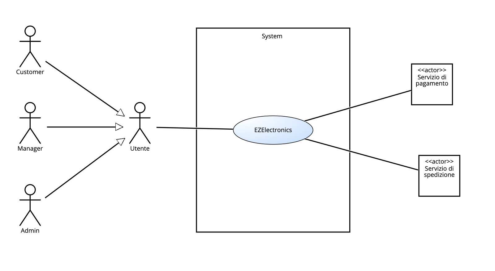
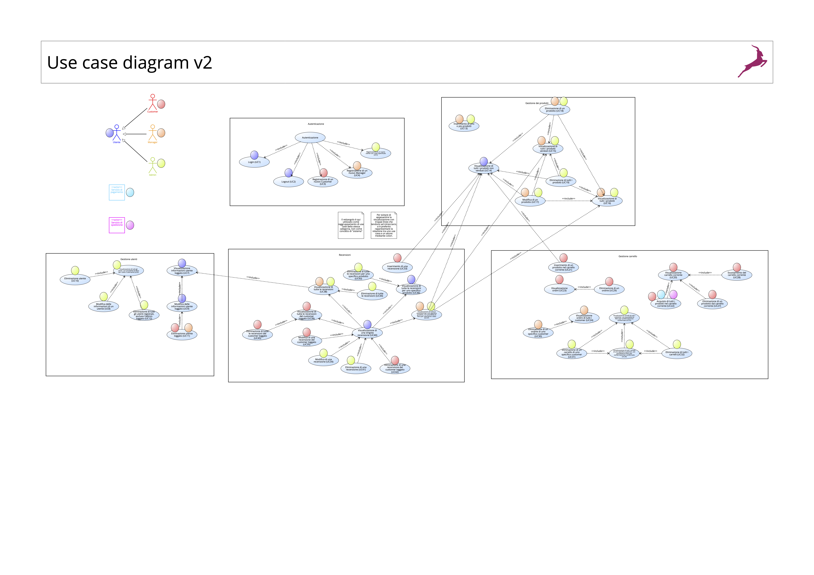
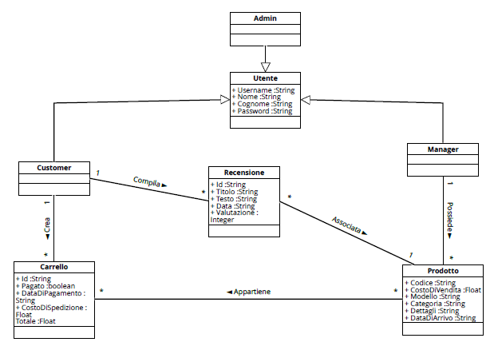
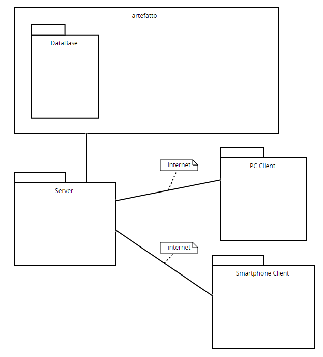

# Requirements Document - future EZElectronics

Date: 05/05/2024

Version: V2 - description of EZElectronics in FUTURE form (as proposed by the team)

| Version number | Change |
| :------------: | :----: |
|         V2     | versione definitiva V2       |

# Contents

- [Requirements Document - future EZElectronics](#requirements-document---future-ezelectronics)
- [Contents](#contents)
- [Informal description](#informal-description)
 - [INFORMAZIONI DI CONTESTO](#informazioni-di-contesto)
- [Stakeholders](#stakeholders)
- [Context Diagram and interfaces](#context-diagram-and-interfaces)
  - [Context Diagram](#context-diagram)
  - [Interfaces](#interfaces)
- [Stories and personas](#stories-and-personas)
- [Functional and non functional requirements](#functional-and-non-functional-requirements)
  - [Functional Requirements](#functional-requirements)
    - [Table of rights](#table-of-rights)
  - [Non Functional Requirements](#non-functional-requirements)
- [Use case diagram and use cases](#use-case-diagram-and-use-cases)
  - [Use case diagram](#use-case-diagram)
    - [Use case 1: Login (UC1)](#use-case-1-login-uc1)
      - [Scenario 1.1](#scenario-11)
      - [Scenario 1.2](#scenario-12)
    - [Use case 2: Logout (UC2)](#use-case-2-logout-uc2)
      - [Scenario 2.1](#scenario-21)
    - [Use case 3: Registrazione di un nuovo Customer (UC3)](#use-case-3-registrazione-di-un-nuovo-customer-uc3)
      - [Scenario 3.1](#scenario-31)
      - [Scenario 3.2](#scenario-32)
      - [Scenario 3.3](#scenario-33)
      - [Scenario 3.4](#scenario-34)
      - [Scenario 3.5](#scenario-35)
    - [Use case 4: Registrazione di un nuovo Manager (UC4)](#use-case-4-registrazione-di-un-nuovo-manager-uc4)
      - [Scenario 4.1](#scenario-41)
      - [Scenario 4.2](#scenario-42)
      - [Scenario 4.3](#scenario-43)
      - [Scenario 4.4](#scenario-44)
      - [Scenario 4.5](#scenario-45)
    - [Use case 5: Registrazione di un nuovo utente con ruolo specificato (UC5)](#use-case-5-registrazione-di-un-nuovo-utente-con-ruolo-specificato-uc5)
      - [Scenario 5.1](#scenario-51)
      - [Scenario 5.2](#scenario-52)
      - [Scenario 5.3](#scenario-53)
      - [Scenario 5.4](#scenario-54)
      - [Scenario 5.5](#scenario-55)
    - [Use case 6: Visualizzazione di tutti gli utenti, con possibilità di filtro per ruolo o username (UC6)](#use-case-6-visualizzazione-di-tutti-gli-utenti-con-possibilità-di-filtro-per-ruolo-o-username-uc6)
      - [Scenario 6.1](#scenario-61)
      - [Scenario 6.2](#scenario-62)
      - [Scenario 6.3](#scenario-63)
    - [Use case 7: Visualizzazione informazioni utente loggato (UC7)](#use-case-7-visualizzazione-informazioni-utente-loggato-uc7)
      - [Scenario 7.1](#scenario-71)
    - [Use case 8: Modifica delle informazioni di un utente (UC8)](#use-case-8-modifica-delle-informazioni-di-un-utente-uc8)
      - [Scenario 8.1](#scenario-81)
      - [Scenario 8.2](#scenario-82)
      - [Scenario 8.3](#scenario-83)
      - [Scenario 8.4](#scenario-84)
    - [Use case 9: Modifica delle informazioni utente loggato (UC9)](#use-case-9-modifica-delle-informazioni-utente-loggato-uc9)
      - [Scenario 9.1](#scenario-91)
      - [Scenario 9.2](#scenario-92)
      - [Scenario 9.3](#scenario-93)
      - [Scenario 9.4](#scenario-94)
    - [Use case 10: Eliminazione utente (UC10)](#use-case-10-eliminazione-utente-uc10)
      - [Scenario 10.1](#scenario-101)
      - [Scenario 10.2](#scenario-102)
    - [Use case 11: Eliminazione utente loggato (UC11)](#use-case-11-eliminazione-utente-loggato-uc11)
      - [Scenario 11.1](#scenario-111)
    - [Use case 12: Eliminazione di tutti gli utenti registrati, escluso l'admin loggato (UC12)](#use-case-12-eliminazione-di-tutti-gli-utenti-registrati-escluso-ladmin-loggato-uc12)
      - [Scenario 12.1](#scenario-121)
    - [Use case 13: Inserimento di uno o più prodotti (UC13)](#use-case-13-inserimento-di-uno-o-più-prodotti-uc13)
      - [Scenario 13.1](#scenario-131)
      - [Scenario 13.2](#scenario-132)
      - [Scenario 13.3](#scenario-133)
      - [Scenario 13.4](#scenario-134)
      - [Scenario 13.5](#scenario-135)
    - [Use case 14: Visualizzazione di tutti i prodotti non venduti (UC14)](#use-case-14-visualizzazione-di-tutti-i-prodotti-non-venduti-uc14)
      - [Scenario 14.1](#scenario-141)
      - [Scenario 14.2](#scenario-142)
      - [Scenario 14.3](#scenario-143)
      - [Scenario 14.4](#scenario-144)
      - [Scenario 14.5](#scenario-145)
    - [Use case 15: Visualizzazione di tutti i prodotti venduti (UC15)](#use-case-15-visualizzazione-di-tutti-i-prodotti-venduti-uc15)
      - [Scenario 15.1](#scenario-151)
      - [Scenario 15.2](#scenario-152)
      - [Scenario 15.3](#scenario-153)
      - [Scenario 15.4](#scenario-154)
      - [Scenario 15.5](#scenario-155)
    - [Use case 16: Visualizzazione di tutti i prodotti (UC16)](#use-case-16-visualizzazione-di-tutti-i-prodotti-uc16)
      - [Scenario 16.1](#scenario-161)
      - [Scenario 16.2](#scenario-162)
      - [Scenario 16.3](#scenario-163)
      - [Scenario 16.4](#scenario-164)
      - [Scenario 16.5](#scenario-165)
    - [Use case 17: Modifica di un prodotto (UC17)](#use-case-17-modifica-di-un-prodotto-uc17)
      - [Scenario 17.1](#scenario-171)
      - [Scenario 17.2](#scenario-172)
      - [Scenario 17.3](#scenario-173)
      - [Scenario 17.4](#scenario-174)
      - [Scenario 17.5](#scenario-175)
      - [Scenario 17.6](#scenario-176)
    - [Use case 18: Eliminazione di un prodotto (UC18)](#use-case-18-eliminazione-di-un-prodotto-uc18)
      - [Scenario 18.1](#scenario-181)
    - [Use case 19: Eliminazione di tutti i prodotti (UC19)](#use-case-19-eliminazione-di-tutti-i-prodotti-uc19)
      - [Scenario 19.1](#scenario-191)
    - [Use case 20: Inserimento di un prodotto nel carrello corrente (UC20)](#use-case-20-inserimento-di-un-prodotto-nel-carrello-corrente-uc20)
      - [Scenario 20.1](#scenario-201)
    - [Use case 21: Acquisto di tutti i prodotti nel carrello corrente (UC21)](#use-case-21-acquisto-di-tutti-i-prodotti-nel-carrello-corrente-uc21)
      - [Scenario 21.1](#scenario-211)
      - [Scenario 21.2](#scenario-212)
      - [Scenario 21.3](#scenario-213)
    - [Use case 22: Visualizzazione ordini (UC22)](#use-case-22-visualizzazione-ordini-uc22)
      - [Scenario 22.1](#scenario-221)
      - [Scenario 22.2](#scenario-222)
      - [Scenario 22.3](#scenario-223)
      - [Scenario 22.4](#scenario-224)
      - [Scenario 22.5](#scenario-225)
    - [Use case 23: Visualizzazione ordini di tutti i customer (UC23)](#use-case-23-visualizzazione-ordini-di-tutti-i-customer-uc23)
      - [Scenario 23.1](#scenario-231)
    - [Use case 24: Visualizzazione carrelli di tutti i customer, con possibilità di filtro per confermato/non confermato (UC24)](#use-case-24-visualizzazione-carrelli-di-tutti-i-customer-con-possibilità-di-filtro-per-confermato-non-confermato-uc24)
      - [Scenario 24.1](#scenario-241)
    - [Use case 25: Visualizzazione di tutti i carrelli di uno specifico customer, con possibilità di filtro per confermato/non confermato (UC25)](#use-case-25-visualizzazione-di-tutti-i-carrelli-di-uno-specifico-customer-con-possibilità-di-filtro-per-confermato-non-confermato-uc25)
      - [Scenario 25.1](#scenario-251)
      - [Scenario 25.2](#scenario-252)
      - [Scenario 25.3](#scenario-253)
    - [Use case 26: Eliminazione di un prodotto dal carrello corrente (UC26)](#use-case-26-eliminazione-di-un-prodotto-dal-carrello-corrente-uc26)
      - [Scenario 26.1](#scenario-261)
    - [Use case 27: Svuotamento del carrello corrente (UC27)](#use-case-27-svuotamento-del-carrello-corrente-uc27)
      - [Scenario 27.1](#scenario-271)
    - [Use case 28: Eliminazione di un ordine (UC28)](#use-case-28-eliminazione-di-un-ordine-uc28)
      - [Scenario 28.1](#scenario-281)
    - [Use case 29: Eliminazione di un ordine di uno specifico customer (UC29)](#use-case-29-eliminazione-di-un-ordine-di-uno-specifico-customer-uc29)
      - [Scenario 29.1](#scenario-291)
    - [Use case 30: Eliminazione di un carrello di uno specifico customer (UC30)](#use-case-30-eliminazione-di-un-carrello-di-uno-specifico-customer-uc30)
      - [Scenario 30.1](#scenario-301)
    - [Use case 31: Eliminazione di tutti i carrelli (UC31)](#use-case-31-eliminazione-di-tutti-i-carrelli-uc31)
      - [Scenario 31.1](#scenario-311)
    - [Use case 32: Inserimento di una recensione (UC32)](#use-case-32-inserimento-di-una-recensione-uc32)
      - [Scenario 32.1](#scenario-321)
    - [Use case 33: Modifica di una recensione (UC33)](#use-case-33-modifica-di-una-recensione-uc33)
      - [Scenario 33.1](#scenario-331)
      - [Scenario 33.2](#scenario-332)
    - [Use case 34: Modifica di una recensione del customer loggato (UC34)](#use-case-34-modifica-di-una-recensione-del-customer-loggato-uc34)
      - [Scenario 34.1](#scenario-341)
      - [Scenario 34.2](#scenario-342)
    - [Use case 35: Visualizzazione di tutte le recensioni per uno specifico prodotto (UC35)](#use-case-35-visualizzazione-di-tutte-le-recensioni-per-uno-specifico-prodotto-uc35)
      - [Scenario 35.1](#scenario-351)
      - [Scenario 35.2](#scenario-352)
      - [Scenario 35.3](#scenario-353)
    - [Use case 36: Visualizzazione di tutte le recensioni per uno specifico prodotto, con possibilità di filtro per username e data (UC36)](#use-case-36-visualizzazione-di-tutte-le-recensioni-per-uno-specifico-prodotto-con-possibilità-di-filtro-per-username-e-data-uc36)
      - [Scenario 36.1](#scenario-361)
    - [Use case 37: Visualizzazione di tutte le recensioni (UC37)](#use-case-37-visualizzazione-di-tutte-le-recensioni-uc37)
      - [Scenario 37.1](#scenario-371)
      - [Scenario 37.2](#scenario-372)
      - [Scenario 37.3](#scenario-373)
    - [Use case 38: Visualizzazione di tutte le recensioni del customer loggato (UC38)](#use-case-38-visualizzazione-di-tutte-le-recensioni-del-customer-loggato-uc38)
      - [Scenario 38.1](#scenario-381)
      - [Scenario 38.2](#scenario-382)
      - [Scenario 38.3](#scenario-383)
      - [Scenario 38.4](#scenario-384)
      - [Scenario 38.5](#scenario-385)
      - [Scenario 38.6](#scenario-386)
    - [Use case 39: Visualizzazione di una singola recensione (UC39)](#use-case-39-visualizzazione-di-una-singola-recensione-uc39)
      - [Scenario 39.1](#scenario-391)
      - [Scenario 39.2](#scenario-392)
      - [Scenario 39.3](#scenario-393)
      - [Scenario 39.4](#scenario-394)
      - [Scenario 39.5](#scenario-395)
    - [Use case 40: Eliminazione di una recensione (UC40)](#use-case-40-eliminazione-di-una-recensione-uc40)
      - [Scenario 40.1](#scenario-401)
    - [Use case 41: Eliminazione di una recensione del customer loggato (UC41)](#use-case-41-eliminazione-di-una-recensione-del-customer-loggato-uc41)
      - [Scenario 41.1](#scenario-411)
    - [Use case 42: Eliminazione di tutte le recensioni per uno specifico prodotto (UC42)](#use-case-42-eliminazione-di-tutte-le-recensioni-per-uno-specifico-prodotto-uc42)
      - [Scenario 42.1](#scenario-421)
      - [Scenario 42.2](#scenario-422)
    - [Use case 43: Eliminazione di tutte le recensioni (UC43)](#use-case-43-eliminazione-di-tutte-le-recensioni-uc43)
      - [Scenario 43.1](#scenario-431)
    - [Use case 44: Eliminazione di tutte le recensioni del customer loggato (UC44)](#use-case-44-eliminazione-di-tutte-le-recensioni-del-customer-loggato-uc44)
      - [Scenario 44.1](#scenario-441)
    - [Use case 45: Eliminazione di tutti i prodotti (UC45)](#use-case-45-eliminazione-di-tutti-i-prodotti-uc45)
      - [Scenario 45.1](#scenario-451)
- [Glossary](#glossary)
- [System Design](#system-design)
- [Deployment Diagram](#deployment-diagram)

# Informal description

EZElectronics (read EaSy Electronics) is a software application designed to help managers of electronics stores to manage their products and offer them to customers through a dedicated website. Managers can assess the available products, record new ones, and confirm purchases. Customers can see available products, add them to a cart and see the history of their past purchases.

## INFORMAZIONI DI CONTESTO

Abbiamo interpretato le informazioni fornite come segue. Noi ci poniamo come sviluppatori di un'applicazione web da distribuire a diverse aziende, ciascuna delle quali intrattiene dei rapporti con clienti. Ogni azienda ha la sua versione del software, un proprio database in cui i manager di quell'azienda possono inserire i prodotti e i clienti possono fare acquisti.

# Stakeholders

| Stakeholder name | Description |
| :--------------: | :---------: |
| Manager | Gestore del negozio di elettronica. Gestisce l'inserzione e la modifica dei prodotti e le operazioni di vendita. |
| Customer | Cliente che visita il sito web. Visualizza i prodotti, gestisce il carrello ed acquista. |
| Admin   | Gestore dell'app        |
| Servizio di pagamento   | Servizio responsabile del pagamento  dei prodotti da parte degli utenti     |
| Servizio di spedizione   | Servizio responsabile della spedizione dei prodotti venduti dallo store ai customer.     |

# Context Diagram and interfaces

## Context Diagram

## Interfaces

|   Actor   | Logical Interface | Physical Interface |
| :-------: | :---------------: | :----------------: |
| Manager   | GUI Manager        | PC/Internet        |
| Cliente   | GUI Cliente        | PC/Smartphone      |
| Admin     | GUI Admin          | PC/Internet       |
| Servizio di pagamento | Interfaccia di pagamento | Internet |
| Servizio di spedizione | Interfaccia di spedizione | Internet |

# Stories and personas

- Luigi - Manager (40 anni)

  Lui può accedere ad un account esistente o effettuare logout. La sua utenza può essere assegnata dall'admin o da un altro manager, e analogamente lui può creare utenze manager per altri utenti. Può visualizzare le proprie informazioni o modificarle. Può cancellarsi dal sistema. Può registrare uno o più prodotti di uno stesso modello, modificarli o cancellarli. Può visualizzare tutti i prodotti, filtrando eventualmente quelli già venduti o non ancora venduti e/o filtrando per categoria o modello. Può cercare un prodotto per codice identificativo. Può visualizzare la lista degli ordini effettuati dai vari customer, ed eventualmente eliminarli. Può visualizzare tutte le recensioni, con possibilità di fitro per username, data, categoria, modello o codice prodotto, ma non gli è permesso modificare o cancellare recensioni.

  Obiettivi: Offrire e mantenere un servizio di qualità per i clienti e fornire un catalogo aggiornato.

- Sara - Customer (25 anni)

  Lei può creare un account, accedere ad un account esistente o effettuare logout. Può visualizzare le proprie informazioni o modificarle. Può cancellarsi dal sistema. Può visualizzare tutti i prodotti non ancora venduti, filtrando eventualmente per categoria o modello. Può cercare un prodotto per codice identificativo. Può gestire un carrello di prodotti non confermato: può visualizzarlo, può aggiungere o rimuovere un singolo prodotto, svuotare l'intero carrello e confermare l'acquisto dei prodotti. Può visualizzare la lista degli ordini effettuati, cancellare un proprio ordine. Può aggiungere una o più recensioni per un prodotto, modificarla o cancellarla. Può visualizzare tutte le recensioni per uno specifico prodotto. Può cancellare tutte le recensioni da lei scritte.

  Obiettivi: acquistare prodotti in modo semplice.

- Luigi - Admin (35 anni)

  Il sistema al momento dell'installazione assegna a lui un'utenza di tipo admin. Lui può effettuare login, logout e creare un utente assegnandogli un ruolo specifico. Può visualizzare tutti gli utenti, potendoli filtrare per ruolo o username. Può visualizzare le proprie informazioni o modificarle. Può cancellare un qualsiasi altro utente ma non se stesso. Può inserire prodotti, modificarli o cancellarli. Può visualizzare i carrelli di tutti i customer, potendoli filtrare per confermato/non confermato, o specifico customer. Può eliminare un carrello, confermato o non confermato, di uno specifico customer. Può modificare una qualsiasi recensione (in qualità di moderatore) o cancellarla, ma non può inserirne di nuove. Può visualizzare tutte le recensioni, potendole filtrare per prodotto, username, data. Può effettuare delle operazioni massive di cancellazione sugli utenti (escluso se stesso), prodotti, carrelli, recensioni.

  Obiettivi: interagire con i dati dell'applicativo senza particolari limitazioni. 

# Functional and non functional requirements

## Functional Requirements

|  ID   | Description |
| :---: | :---------: |
|  **FR1**  |      **Autenticazione**    |
|FR1.1| Login|
|FR1.2| Logout|
|FR1.3| Registrazione di un nuovo Customer|
|FR1.4| Registrazione di un nuovo Manager|
|FR1.5| Registrazione di un nuovo utente con ruolo specificato|
| --- | --------- |
| **FR2** | **Gestione utenti**|
|FR2.1| Visualizzazione di tutti gli utenti, con possibilità di filtro per ruolo o username|
|FR2.2| Visualizzazione informazioni utente loggato|
|FR2.3| Modifica delle informazioni di un utente|
|FR2.4| Modifica delle informazioni utente loggato|
|FR2.5| Eliminazione utente|
|FR2.6| Eliminazione utente loggato|
|FR2.7| Eliminazione di tutti gli utenti registrati, escluso l'admin loggato |
| --- | --------- |
|**FR3**| **Gestione dei prodotti**|
|FR3.1| Inserimento di uno o più prodotti |
|FR3.2| Visualizzazione di tutti i prodotti non venduti|
|FR3.3| Visualizzazione di tutti i prodotti venduti|
|FR3.4| Visualizzazione di tutti i prodotti|
|FR3.5| Modifica di un prodotto|
|FR3.6| Eliminazione di un prodotto|
|FR3.7| Eliminazione di tutti i prodotti|
| --- | --------- |
|**FR4**| **Gestione carrello**|
|FR4.1| Visualizzazione carrello corrente|
|FR4.2| Inserimento di un prodotto nel carrello corrente|
|FR4.3| Acquisto di tutti i prodotti nel carrello corrente|
|FR4.4| Visualizzazione ordini|
|FR4.5| Visualizzazione ordini di tutti i customer|
|FR4.6| Visualizzazione carrelli di tutti i customer, con possibilità di filtro per confermato/non confermato|
|FR4.7| Visualizzazione di tutti i carrelli di uno specifico customer, con possibilità di filtro per confermato/non confermato|
|FR4.8| Eliminazione di un prodotto dal carrello corrente|
|FR4.9| Svuotamento del carrello corrente|
|FR4.10| Eliminazione di un ordine |
|FR4.11| Eliminazione di un ordine di uno specifico customer|
|FR4.12| Eliminazione di un carrello di uno specifico customer|
|FR4.13| Eliminazione di tutti i carrelli|
| --- | --------- |
|**FR5**| **Recensioni**|
|FR5.1| Inserimento di una recensione|
|FR5.2| Modifica di una recensione|
|FR5.3| Modifica di una recensione del customer loggato|
|FR5.4| Visualizzazione di tutte le recensioni per uno specifico prodotto|
|FR5.5| Visualizzazione di tutte le recensioni per uno specifico prodotto, con possibilità di filtro per username e data|
|FR5.6| Visualizzazione di tutte le recensioni|
|FR5.7| Visualizzazione di tutte le recensioni del customer loggato|
|FR5.8| Visualizzazione di una singola recensione|
|FR5.9| Eliminazione di una recensione |
|FR5.10| Eliminazione di una recensione del customer loggato |
|FR5.11| Eliminazione di tutte le recensioni per uno specifico prodotto|
|FR5.12| Eliminazione di tutte le recensioni|
|FR5.13| Eliminazione di tutte le recensioni del customer loggato|

### Table of rights
|Function |Customer       |Manager      |Admin| 
| :-----: | :--------------------------------: | :---------: | :-------: |
| **FR1 Autenticazione** | -------               | -------     |   ------- |
CMA
| FR1.1 | x            | x   |   x |
| FR1.2 | x            | x   |   x |
| FR1.3 | x            |    |    |
| FR1.4 |             |  x   |    |
| FR1.5 |              |    |   x |
| **FR2 Gestione utenti** | -------               | -------     |   ------- |
| FR2.1 |              |     |   x |
| FR2.2 | x             | x    |   x |
| FR2.3 |             |    |   x |
| FR2.4 | x             | x    |   x |
| FR2.5 |              |     |   x |
| FR2.6 | x            | x   |    |
| FR2.7 |             |    |   x |
| **FR3 Gestione dei prodotti** | -------               | -------     |   ------- |
| FR3.1 |              | x   |   x |
| FR3.2 | x             | x   |   x |
| FR3.3 |              | x   |   x |
| FR3.4 |              | x    |   x |
| FR3.5 |             | x   |   x |
| FR3.6 |              | x   |   x |
| FR3.7 |              |    |   x |
| **FR4 Gestione carrello utente** | -------               | -------     |   ------- |
| FR4.1 | x            |     |    |
| FR4.2 | x            |     |    |
| FR4.3 | x            |     |    |
| FR4.4 | x            |    |    |
| FR4.5 |             |  x   |    |
| FR4.6 |              |    |   x |
| FR4.7 |              |     |   x |
| FR4.8 | x             |     |    |
| FR4.9 | x            |     |    |
| FR4.10| x            |     |    |
| FR4.11|              | x    |    |
| FR4.12|              |     |   x |
| FR4.13|              |     |   x |
| **FR5 Recensioni** | -------               | -------     |   ------- |
| FR5.1 | x            |     |    |
| FR5.2 |             |     |   x |
| FR5.3 | x            |   |    |
| FR5.4 | x             | x   |   x |
| FR5.5 |              | x   |   x |
| FR5.6 |              |  x   |   x |
| FR5.7 | x            |     |    |
| FR5.8 | x             | x    |   x |
| FR5.9 |            |     |   x |
| FR5.10| x            |     |    |
| FR5.11|              |     |   x |
| FR5.12|              |     |   x |
| FR5.13| x             |     |    |

## Non Functional Requirements

|   ID    | Type (efficiency, reliability, ..) | Description | Refers to |
| :-----: | :--------------------------------: | :---------: | :-------: |
|  NFR1   | Efficienza | Il sistema deve garantire un tempo di risposta di massimo un secondo. Deve garantire un carico inferiore al 25% delle risorse di cpu. | FR1, FR2, FR3, FR4, FR5 |
|  NFR2   | Affidabilità | Gli utenti non devono riferire più di un bug all'anno ciascuno. Il sistema deve essere disponibile per il 95% del tempo operativo. Il 100% degli errori devone essere espressi nel modo corretto fornendo messaggi e codici specifici. | FR1, FR2, FR3, FR4, FR5 |
|  NFR3   | Sicurezza | Protezione dei dati sensibili degli utenti. Soltanto un utente customer può accedere alla funzionalità di gestione carrello. Soltanto un utente manager può registrare il prodotto, la sua vendita o cancellarlo. | FR1, FR2, FR3, FR4, FR5 |
|  NFR4   | Usabilità | Gli utenti non devono imparare a usare il sito. Facilità d'uso: tempo d'apprendimento tendente a 0. Accessibilità: il sistema deve aderire al 100% degli standard web per l'accessibilità | FR1, FR2, FR3, FR4, FR5 |
|  NFR5   | Scalabilità | Gestione di un aumento del carico utente senza perdita di prestazioni. | FR1, FR2, FR3, FR4, FR5 |

# Use case diagram and use cases

## Use case diagram

### Use case 1: Login (UC1)
| Actors Involved | Utente   |
| :--------------: | :-------------------------------------------------------------------------------------------------: |
|   Precondition   | L'utente è già registrato ma non è loggato. |
|  Post condition  | L'utente è loggato.  |
| Nominal Scenario | Scenario 1.1   |
|     Variants     |    Nessuna          |
|    Exceptions    | Scenario 1.2  |

##### Scenario 1.1
|  Scenario 1.1  |  Accesso all'account con successo  |
| :------------: | :------------------------------------------------------------------------: |
|  Precondition  | L'utente è già registrato ma non è loggato.      |
| Post condition | L'utente è loggato.    |
|     Step#      |     Description   |
|       1        | L'utente chiede di effettuare il login.  |
|       2        | Il sistema richiede l'inserimento di username e password.              |
|       3        | L'utente inserisce i dati richiesti.                               |
|       4        | Il sistema verifica i dati inseriti: l'username esiste e la password è corretta.                                        |
|       5       | Il sistema autentica l'utente.                                             |

##### Scenario 1.2
|  Scenario 1.2  |    Credenziali errate      |
| :------------: | :------------------------------------------------------------------------: |
|  Precondition  | L'utente è già registrato ma non è loggato.    |
| Post condition | Nessuna.   |
|     Step#      |     Description     |
|       1        | L'utente chiede di effettuare il login.  |
|       2        | Il sistema richiede l'inserimento di username e password.              |
|       3        | L'utente inserisce i dati richiesti.                               |
|       4        | Il sistema verifica i dati inseriti: la coppia di credenziali (username, password) non coincide con quella memorizzata.         |
|       5       | Il sistema mostra un messaggio di errore. |   

### Use case 2: Logout (UC2)
| Actors Involved |   Utente   |
| :--------------: | :------------------------------------------------------------------: |
|   Precondition   | L'utente è loggato.    |
|  Post condition  | L'utente non è loggato.     |
| Nominal Scenario | Scenario 2.1   |
|     Variants     |                     Nessuna variante.           |
|    Exceptions    | Nessuna eccezione.                        |

##### Scenario 2.1
|  Scenario 2.1  |     Logout           |
| :------------: | :------------------------------------------------------------------------: |
|  Precondition  | L'utente è loggato.       |
| Post condition | L'utente non è loggato.     |
|     Step#      |   Description       |
|       1        | L'utente chiede di disconnettersi.   |
|       2        | Il sistema effettua il logout.    |

### Use case 3: Registrazione di un nuovo Customer (UC3)

| Actors Involved  |  Customer   |
| :--------------: | :------------------------------------------------------------------: |
|   Precondition   | Il customer non deve essere già registrato né loggato.                              |
|  Post condition  | Il customer è registrato.                        |
| Nominal Scenario | Scenario 3.1     |
|     Variants     |         Nessuna        |
|    Exceptions    | Scenario 3.2, Scenario 3.3, Scenario 3.4, Scenario 3.5 |

##### Scenario 3.1
|  Scenario 3.1  |  Creazione account con successo |
| :------------: | :---------------------------------------------------------------------------------------------------: |
|  Precondition  | Il customer non deve essere già registrato né loggato.                                                               |
| Post condition | Il customer è registrato.                  |
|     Step#      |      Description         |
|       1        | Il customer chiede di effettuare la registrazione. |
|       2        | Il sistema chiede l'inserimento dei dati (username, nome, cognome, password, conferma password, email).                        |
|       3        | Il customer inserisce i dati richiesti.                     |
|       4        | Il sistema verifica i dati inseriti: le 2 password coincidono e sono sicure, l'username non esiste già e l'email è valida.                              |
|       5        | Il sistema registra il customer.                  |

##### Scenario 3.2
|  Scenario 3.2  |  Username già esistente |
| :------------: | :---------------------------------------------------------------------------------------------------: |
|  Precondition  | Il customer non deve essere già registrato né loggato.                                                               |
| Post condition | Nessuna.                    |
|     Step#      |      Description         |
|       1        | Il customer chiede di effettuare la registrazione. |
|       2        | Il sistema chiede l'inserimento dei dati (username, nome, cognome, password, conferma password, email).                        |
|       3        | Il customer inserisce i dati richiesti.                     |
|       4        | Il sistema verifica i dati inseriti: l'username esiste già.                              |
|       5        | Il sistema mostra un messaggio di errore.             |

##### Scenario 3.3
|  Scenario 3.3  |  Password non corrispondenti |
| :------------: | :---------------------------------------------------------------------------------------------------: |
|  Precondition  | Il customer non deve essere già registrato né loggato.                                                               |
| Post condition | Nessuna.                    |
|     Step#      |      Description         |
|       1        | Il customer chiede di effettuare la registrazione. |
|       2        | Il sistema chiede l'inserimento dei dati (username, nome, cognome, password, conferma password, email).                        |
|       3        | Il customer inserisce i dati richiesti.                     |
|       4        | Il sistema verifica i dati inseriti: le 2 password digitate non coincidono.          |
|       5        | Il sistema mostra un messaggio di errore.             |

##### Scenario 3.4
|  Scenario 3.4  |  Password non sicura |
| :------------: | :---------------------------------------------------------------------------------------------------: |
|  Precondition  | Il customer non deve essere già registrato né loggato.                                                               |
| Post condition | Nessuna.                    |
|     Step#      |      Description         |
|       1        | Il customer chiede di effettuare la registrazione. |
|       2        | Il sistema chiede l'inserimento dei dati (username, nome, cognome, password, conferma password, email).                        |
|       3        | Il customer inserisce i dati richiesti.                     |
|       4        | Il sistema verifica i dati inseriti: la password digitata non è sicura.          |
|       5        | Il sistema mostra un messaggio di errore.             |

##### Scenario 3.5
|  Scenario 3.5  |  Email non valida |
| :------------: | :---------------------------------------------------------------------------------------------------: |
|  Precondition  | Il customer non deve essere già registrato né loggato.                                                               |
| Post condition | Nessuna.                    |
|     Step#      |      Description         |
|       1        | Il customer chiede di effettuare la registrazione. |
|       2        | Il sistema chiede l'inserimento dei dati (username, nome, cognome, password, conferma password, email).                        |
|       3        | Il customer inserisce i dati richiesti.                     |
|       4        | Il sistema verifica i dati inseriti: l'email non è valida.
|       5        | Il sistema mostra un messaggio di errore.             |

### Use case 4: Registrazione di un nuovo Manager (UC4)

| Actors Involved  |  Manager concedente e Manager concessionario   |
| :--------------: | :------------------------------------------------------------------: |
|   Precondition   | Il manager concedente deve essere loggato e il manager concessionario non è già registrato.         |
|  Post condition  | Il manager concessionario è registrato.           |
| Nominal Scenario | Scenario 4.1     |
|     Variants     |         Nessuna        |
|    Exceptions    | Scenario 4.2, Scenario 4.3, Scenario 4.4, Scenario 4.5 |

##### Scenario 4.1
|  Scenario 4.1  |  Creazione account con successo |
| :------------: | :---------------------------------------------------------------------------------------------------: |
|   Precondition   | Il manager concedente deve essere loggato e il manager concessionario non è già registrato.         |
|  Post condition  | Il manager concessionario è registrato.           |
|     Step#      |      Description         |
|       1        | Il manager concedente chiede di creare una nuova utenza Manager. |
|       2        | Il sistema chiede l'inserimento dei dati (username, nome, cognome, password, conferma password, email).                        |
|       3        | Il manager concedente inserisce i dati richiesti.                     |
|       4        | Il sistema verifica i dati inseriti: le 2 password coincidono e sono sicure, l'username non esiste già e l'email è valida.                              |
|       5        | Il sistema registra il manager concessionario.                  |

##### Scenario 4.2
|  Scenario 4.2  |  Username già esistente |
| :------------: | :---------------------------------------------------------------------------------------------------: |
|   Precondition   | Il manager concedente deve essere loggato e il manager concessionario non è già registrato.         |
|  Post condition  | Nessuna.   |
|     Step#      |      Description         |
|       1        | Il manager concedente chiede di creare una nuova utenza Manager. |
|       2        | Il sistema chiede l'inserimento dei dati (username, nome, cognome, password, conferma password, email).                        |
|       3        | Il manager concedente inserisce i dati richiesti.                     |
|       4        | Il sistema verifica i dati inseriti: l'username esiste già.                              |
|       5        | Il sistema mostra un messaggio di errore.     |

##### Scenario 4.3
|  Scenario 4.3  |  Password non corrispondenti |
| :------------: | :---------------------------------------------------------------------------------------------------: |
|   Precondition   | Il manager concedente deve essere loggato e il manager concessionario non è già registrato.         |
|  Post condition  | Nessuna.   |
|     Step#      |      Description         |
|       1        | Il manager concedente chiede di creare una nuova utenza Manager. |
|       2        | Il sistema chiede l'inserimento dei dati (username, nome, cognome, password, conferma password, email).                        |
|       3        | Il manager concedente inserisce i dati richiesti.                     |
|       4        | Il sistema verifica i dati inseriti: le 2 password non coincidono.         |
|       5        | Il sistema mostra un messaggio di errore.     |

##### Scenario 4.4
|  Scenario 4.4  |  Password non sicura |
| :------------: | :---------------------------------------------------------------------------------------------------: |
|   Precondition   | Il manager concedente deve essere loggato e il manager concessionario non è già registrato.         |
|  Post condition  | Nessuna.   |
|     Step#      |      Description         |
|       1        | Il manager concedente chiede di creare una nuova utenza Manager. |
|       2        | Il sistema chiede l'inserimento dei dati (username, nome, cognome, password, conferma password, email).                        |
|       3        | Il manager concedente inserisce i dati richiesti.                     |
|       4        | Il sistema verifica i dati inseriti: la password digitata non è sicura.    |
|       5        | Il sistema mostra un messaggio di errore.     |

##### Scenario 4.5
|  Scenario 4.5  |  Email non valida |
| :------------: | :---------------------------------------------------------------------------------------------------: |
|   Precondition   | Il manager concedente deve essere loggato e il manager concessionario non è già registrato.         |
|  Post condition  | Nessuna.   |
|     Step#      |      Description         |
|       1        | Il manager concedente chiede di creare una nuova utenza Manager. |
|       2        | Il sistema chiede l'inserimento dei dati (username, nome, cognome, password, conferma password, email).                        |
|       3        | Il manager concedente inserisce i dati richiesti.                     |
|       4        | Il sistema verifica i dati inseriti: l'email non è valida.        |
|       5        | Il sistema mostra un messaggio di errore.     |

### Use case 5: Registrazione di un nuovo utente con ruolo specificato (UC5)

| Actors Involved  | Admin |
| :--------------: | :------------------------------------------------------------------: |
|   Precondition   | L'admin deve essere loggato.  |
|  Post condition  | L'utente è registrato.  |
| Nominal Scenario | Scenario 5.1     |
|     Variants     |         Nessuna        |
|    Exceptions    | Scenario 5.2, Scenario 5.3, Scenario 5.4 |

##### Scenario 5.1
|  Scenario 5.1  |  Creazione account con successo |
| :------------: | :---------------------------------------------------------------------------------------------------: |
|   Precondition   | L'admin deve essere loggato.         |
|  Post condition  | L'utente è registrato.    |
|     Step#      |      Description         |
|       1        | L'admin chiede di creare una nuova utenza per un altro utente. |
|       2        | Il sistema chiede l'inserimento dei dati (username, nome, cognome, password, conferma password, email, ruolo).                        |
|       3        | L'admin inserisce i dati richiesti.                     |
|       4        | Il sistema verifica i dati inseriti: le 2 password coincidono e sono sicure, l'username non esiste già.                              |
|       5        | Il sistema registra l'utente.         |

##### Scenario 5.2
|  Scenario 5.2  |  Username già esistente |
| :------------: | :--------------------------------------: |
|   Precondition   | L'admin deve essere loggato.         |
|  Post condition  | Nessuna.    |
|     Step#      |      Description         |
|       1        | L'admin chiede di creare una nuova utenza per un altro utente. |
|       2        | Il sistema chiede l'inserimento dei dati (username, nome, cognome, password, conferma password, email, ruolo).                        |
|       3        | L'admin inserisce i dati richiesti.                     |
|       4        | Il sistema verifica i dati inseriti: l'username esiste già.                              |
|       5        | Il sistema mostra un messaggio di errore.    |

##### Scenario 5.3
|  Scenario 5.3  |  Password non corrispondenti |
| :------------: | :--------------------------------------: |
|   Precondition   | L'admin deve essere loggato.         |
|  Post condition  | Nessuna.    |
|     Step#      |      Description         |
|       1        | L'admin chiede di creare una nuova utenza per un altro utente. |
|       2        | Il sistema chiede l'inserimento dei dati (username, nome, cognome, password, conferma password, email, ruolo).                        |
|       3        | L'admin inserisce i dati richiesti.                     |
|       4        | Il sistema verifica i dati inseriti: le 2 password non coincidono.            |
|       5        | Il sistema mostra un messaggio di errore.    |

##### Scenario 5.4
|  Scenario 5.4 | Password non sicura |
| :------------: | :--------------------------------------: |
|   Precondition   | L'admin deve essere loggato.         |
|  Post condition  | Nessuna.    |
|     Step#      |      Description         |
|       1        | L'admin chiede di creare una nuova utenza per un altro utente. |
|       2        | Il sistema chiede l'inserimento dei dati (username, nome, cognome, password, conferma password, email, ruolo).                        |
|       3        | L'admin inserisce i dati richiesti.                     |
|       4        | Il sistema verifica i dati inseriti: la password non è sicura.            |
|       5        | Il sistema mostra un messaggio di errore.    |

##### Scenario 5.5
|  Scenario 5.5 | Email non valida |
| :------------: | :--------------------------------------: |
|   Precondition   | L'admin deve essere loggato.         |
|  Post condition  | Nessuna.    |
|     Step#      |      Description         |
|       1        | L'admin chiede di creare una nuova utenza per un altro utente. |
|       2        | Il sistema chiede l'inserimento dei dati (username, nome, cognome, password, conferma password, email, ruolo).                        |
|       3        | L'admin inserisce i dati richiesti.                     |
|       4        | Il sistema verifica i dati inseriti: l'email non è valida.            |
|       5        | Il sistema mostra un messaggio di errore.    |

### Use case 6: Visualizzazione di tutti gli utenti, con possibilità di filtro per ruolo o username (UC6)
| Actors Involved |   Admin    |
| :--------------: | :------------------------------------------------------------------: |
|   Precondition   | L'admin è loggato.   |
|  Post condition  | Nessuna.     |
| Nominal Scenario | Scenario 6.1         |
|     Variants     | Scenario 6.2, Scenario 6.3       |
|    Exceptions    | Nessuna                 |

##### Scenario 6.1
|  Scenario 6.1  |   Visualizzazione di tutti gli utenti     |
| :------------: | :------------------------------------------------------------------------: |
|  Precondition  | L'admin è loggato.    |
| Post condition | Nessuna.     |
|     Step#      |                                Description             |
|       1        | L'admin chiede di visualizzare la lista di tutti gli utenti.                   |
|       2        | Il sistema mostra i dati dell'utente.                                       |

##### Scenario 6.2
|  Scenario 6.2  |   Visualizzazione di tutti gli utenti filtrati per ruolo     |
| :------------: | :------------------------------------------------------------------------: |
|  Precondition  | L'admin è loggato.    |
| Post condition | Nessuna.     |
|     Step#      |                                Description             |
|       1        | L'admin chiede di visualizzare la lista di tutti gli utenti.                   |
|       2        | Il sistema mostra i dati dell'utente.                                       |
|       3        | L'admin chiede di filtrare la lista per uno specifico ruolo.           |
|       4        | Il sistema mostra i dati filtrati.                                       |

##### Scenario 6.3
|  Scenario 6.3  |   Visualizzazione di tutti gli utenti filtrati per username     |
| :------------: | :------------------------------------------------------------------------: |
|  Precondition  | L'admin è loggato.    |
| Post condition | Nessuna.     |
|     Step#      |                                Description             |
|       1        | L'admin chiede di visualizzare la lista di tutti gli utenti.                   |
|       2        | Il sistema mostra i dati dell'utente.                                       |
|       3        | L'admin chiede di filtrare la lista per uno specifico username.           |
|       4        | Il sistema mostra i dati filtrati.                                       |

### Use case 7: Visualizzazione informazioni utente loggato (UC7)
| Actors Involved |   Utente    |
| :--------------: | :------------------------------------------------------------------: |
|   Precondition   | L'utente è loggato.   |
|  Post condition  | Nessuna.     |
| Nominal Scenario | Scenario 7.1        |
|     Variants     |                     Nessuna                                  |
|    Exceptions    | Nessuna                 |

##### Scenario 7.1
|  Scenario 7.1  |   Visualizzazione dei dati dell'account     |
| :------------: | :------------------------------------------------------------------------: |
|  Precondition  | L'utente è loggato.    |
| Post condition | Nessuna.     |
|     Step#      |                                Description             |
|       1         | L'utente chiede di visualizzare i dati del suo account.                   |
|       2        | Il sistema mostra i dati dell'utente.        |

### Use case 8: Modifica delle informazioni di un utente (UC8)
| Actors Involved |   Admin    |
| :--------------: | :------------------------------------------------------------------: |
|   Precondition   | L'admin è loggato AND UC6.   |
|  Post condition  | Il sistema registra le modifiche.     |
| Nominal Scenario | Scenario 8.1        |
|     Variants     |                     Nessuna                                  |
|    Exceptions    | Scenario 8.2, Scenario 8.3, Scenario 8.4           |

##### Scenario 8.1
|  Scenario 8.1  |   Modifica delle informazioni di un utente con successo     |
| :------------: | :------------------------------------------------------------------------: |
|  Precondition  | L'admin è loggato AND UC6.    |
| Post condition | Il sistema registra le modifiche.    |
|     Step#      |                                Description             |
|       1        | L'admin seleziona l'utente da modificare.                   |
|       2        | Il sistema mostra i dati dell'utente.                |
|       3        | L'admin modifica i dati dell'utente (nome, cognome, email, password, conferma password).        |
|       4        | Il sistema verifica i dati inseriti: le 2 password coincidono e sono sicure e l'email è valida. |
|       5        | Il sistema registra le modifiche.        |

##### Scenario 8.2
|  Scenario 8.2  | Password non corrispondenti     |
| :------------: | :------------------------------------------------------------------------: |
|  Precondition  | L'admin è loggato AND UC6.   |
| Post condition | Nessuna.     |
|     Step#      |                                Description             |
|       1        | L'admin seleziona l'utente da modificare.                   |
|       2        | Il sistema mostra i dati dell'utente.                |
|       3        | L'admin modifica i dati dell'utente (nome, cognome, email, password, conferma password).        |
|       4        | Il sistema verifica i dati inseriti: le 2 password non coincidono. |
|       5        | Il sistema mostra un messaggio di errore.        |

##### Scenario 8.3
|  Scenario 8.3  | Password non sicura     |
| :------------: | :------------------------------------------------------------------------: |
|  Precondition  | L'admin è loggato AND UC6.   |
| Post condition | Nessuna.     |
|     Step#      |                                Description             |
|       1        | L'admin seleziona l'utente da modificare.                   |
|       2        | Il sistema mostra i dati dell'utente.                |
|       3        | L'admin modifica i dati dell'utente (nome, cognome, email, password, conferma password).        |
|       4        | Il sistema verifica i dati inseriti: la password digitata non è sicura. |
|       5        | Il sistema mostra un messaggio di errore.        |

##### Scenario 8.4
|  Scenario 8.4  | Email non valida     |
| :------------: | :------------------------------------------------------------------------: |
|  Precondition  | L'admin è loggato AND UC6.   |
| Post condition | Nessuna.     |
|     Step#      |                                Description             |
|       1        | L'admin seleziona l'utente da modificare.                   |
|       2        | Il sistema mostra i dati dell'utente.                |
|       3        | L'admin modifica i dati dell'utente (nome, cognome, email, password, conferma password).        |
|       4        | Il sistema verifica i dati inseriti: l'email non è valida. |
|       5        | Il sistema mostra un messaggio di errore.        |

### Use case 9: Modifica delle informazioni utente loggato (UC9)
| Actors Involved |   Utente    |
| :--------------: | :------------------------------------------------------------------: |
|   Precondition   | L'utente è loggato AND UC7.   |
|  Post condition  | Il sistema registra le modifiche.    |
| Nominal Scenario | Scenario 9.1        |
|     Variants     |                     Nessuna                                  |
|    Exceptions    | Scenario 9.2, Scenario 9.3, Scenario 9.4           |

##### Scenario 9.1
|  Scenario 9.1  |   Modifica delle informazioni utente loggato con successo     |
| :------------: | :------------------------------------------------------------------------: |
|  Precondition  | L'utente è loggato AND UC7.    |
| Post condition | Il sistema registra le modifiche.  |
|     Step#      |                                Description             |
|       1        | L'utente modifica i propri dati (nome, cognome, email, password, conferma password).        |
|       2        | Il sistema verifica i dati inseriti: le 2 password coincidono e sono sicure e l'email è valida. |
|       3        | Il sistema registra le modifiche.        |

##### Scenario 9.2
|  Scenario 9.2  | Password non corrispondenti     |
| :------------: | :------------------------------------------------------------------------: |
|  Precondition  | L'utente è loggato AND UC7.  |
| Post condition | Nessuna  |
|     Step#      |                                Description             |
|       1        | L'utente modifica i propri dati (nome, cognome, email, password, conferma password).        |
|       2        | Il sistema verifica i dati inseriti: le 2 password non coincidono. |
|       3        | Il sistema mostra un messaggio di errore.     |

##### Scenario 9.3
|  Scenario 9.3  | Password non sicura     |
| :------------: | :------------------------------------------------------------------------: |
|  Precondition  | L'utente è loggato AND UC7.  |
| Post condition | Nessuna  |
|     Step#      |                                Description             |
|       1        | L'utente modifica i propri dati (nome, cognome, email, password, conferma password).        |
|       2        | Il sistema verifica i dati inseriti: la password digitata non è sicura. |
|       3        | Il sistema mostra un messaggio di errore.     |

##### Scenario 9.4
|  Scenario 9.4  | Email non valida     |
| :------------: | :------------------------------------------------------------------------: |
|  Precondition  | L'utente è loggato AND UC7.  |
| Post condition | Nessuna  |
|     Step#      |                                Description             |
|       1        | L'utente modifica i propri dati (nome, cognome, email, password, conferma password).        |
|       2        | Il sistema verifica i dati inseriti: l'email non è valida. |
|       3        | Il sistema mostra un messaggio di errore.     |

### Use case 10: Eliminazione utente (UC10)
| Actors Involved |   Admin    |
| :--------------: | :------------------------------------------------------------------: |
|   Precondition   | L'admin è loggato AND UC6.   |
|  Post condition  | Utente eliminato.     |
| Nominal Scenario | Scenario 10.1        |
|     Variants     |                     Nessuna                                  |
|    Exceptions    | Nessuna                 |

##### Scenario 10.1
|  Scenario 10.1  | Eliminazione utente con successo   |
| :------------: | :------------------------------------------------------------------------: |
|  Precondition  | L'admin è loggato AND UC6.    |
| Post condition | Utente eliminato.   |
|     Step#      |                                Description             |
|       1        | L'admin chiede di cancellare un utente specifico.                  |
|       2        | Il sistema verifica: l'utente selezionato non è l'admin loggato. |
|       3        | Il sistema registra la cancellazione dell'utente.        |

##### Scenario 10.2
|  Scenario 10.2  | Cancellazione non permessa  |
| :------------: | :------------------------------------------------------------------------: |
|  Precondition  | L'admin è loggato AND UC6.    |
| Post condition | Nessuna.  |
|     Step#      |                                Description             |
|       1        | L'admin chiede di cancellare un utente specifico.                  |
|       2        | Il sistema verifica: l'utente selezionato è l'admin loggato. |
|       3        | Il sistema mostra un messaggio di errore.     |

### Use case 11: Eliminazione utente loggato (UC11)
| Actors Involved |   Customer o Manager    |
| :--------------: | :------------------------------------------------------------------: |
|   Precondition   | Il customer/manager è loggato AND UC7.   |
|  Post condition  | Customer/manager eliminato.     |
| Nominal Scenario | Scenario 11.1        |
|     Variants     |                     Nessuna                                  |
|    Exceptions    | Nessuna                 |

##### Scenario 11.1
|  Scenario 11.1  | Eliminazione utente loggato  |
| :------------: | :------------------------------------------------------------------------: |
|  Precondition  | Il customer/manager è loggato AND UC7.    |
| Post condition | Customer/manager eliminato.   |
|     Step#      |                                Description             |
|       1        | Il customer/manager chiede di cancellarsi dal sistema.                  |
|       2        | Il sistema registra la cancellazione dell'utente.        |

### Use case 12: Eliminazione di tutti gli utenti registrati, escluso l'admin loggato (UC12)
| Actors Involved |   Admin    |
| :--------------: | :------------------------------------------------------------------: |
|   Precondition   | L'admin è loggato AND UC6.   |
|  Post condition  | Tutti gli utenti sono stati eliminati, ad eccezione dell'admin loggato. |
| Nominal Scenario | Scenario 11.1        |
|     Variants     |     Nessuna       |
|    Exceptions    | Nessuna                 |

##### Scenario 12.1
|  Scenario 12.1  | Eliminazione utente loggato  |
| :------------: | :------------------------------------------------------------------------: |
|  Precondition  | L'admin è loggato AND UC6.    |
| Post condition | Tutti gli utenti sono stati eliminati, ad eccezione dell'admin loggato.  |
|     Step#      |                                Description             |
|       1        | L'admin chiede la cancellazione di tutti gli utenti.          |
|       2        | Il sistema registra la cancellazione di tutti gli utenti, ad eccezione dell'admin loggato.       |

### Use case 13: Inserimento di uno o più prodotti (UC13)
| Actors Involved | Manager o Admin                                                              |
| :--------------: | :------------------------------------------------------------------: |
|   Precondition   | Il manager/admin è loggato.                                             |
|  Post condition  | I prodotti sono stati registrati.                             |
| Nominal Scenario | Scenario 13.1                   |
|     Variants     |                     Nessuna variante                                 |
|    Exceptions    | Scenario 13.2, Scenario 13.3, Scenario 13.4, Scenario 13.5    |

##### Scenario 13.1
|  Scenario 13.1 | Registrazione dei prodotti avvenuta con successo                         |
| :------------: | :------------------------------------------------------------------------: |
|  Precondition  | Il manager/admin è loggato.                                                   |
|  Post condition| I prodotti sono stati registrati.                                       |
|     Step#      |                                Description                                 |
|       1        | Il manager/admin chiede di inserire uno o più prodotti.                       |
|       2        | Il sistema chiede di fornire modello, categoria, dettagli, quantità, data di arrivo, prezzo di vendita.                         |
|       3        | Il manager/admin inserisce la data richiesta.       |
|       4        | Il sistema verifica i dati inseriti: il modello è valido, la categoria è valida, la quantità è maggiore di zero, la data è nulla oppure è nel formato YYYY-MM-DD, il prezzo di vendita è maggiore di zero.              |
|       5        | Il sistema registra il prodotto.                                           |

##### Scenario 13.2
|  Scenario 13.2 | Modello non valido                   |
| :------------: | :------------------------------------------------------------------------: |
|  Precondition  | Il manager/admin è loggato.                                                   |
|  Post condition| Nessuna.                                  |
|     Step#      |                                Description                                 |
|       1        | Il manager/admin chiede di inserire uno o più prodotti.                       |
|       2        | Il sistema chiede di fornire modello, categoria, dettagli, quantità, data di arrivo, prezzo di vendita.                         |
|       3        | Il manager/admin inserisce i dati richiesti.       |
|       4        | Il sistema verifica i dati inseriti: il modello non è valido.              |
|       5        | Il sistema mostra un messaggio di errore.                                      |

##### Scenario 13.3
|  Scenario 13.3 | Categoria non valida                 |
| :------------: | :------------------------------------------------------------------------: |
|  Precondition  | Il manager/admin è loggato.                                                   |
|  Post condition| Nessuna.                                  |
|     Step#      |                                Description                                 |
|       1        | Il manager/admin chiede di inserire uno o più prodotti.                       |
|       2        | Il sistema chiede di fornire modello, categoria, dettagli, quantità, data di arrivo, prezzo di vendita.                         |
|       3        | Il manager/admin inserisce i dati richiesti.       |
|       4        | Il sistema verifica i dati inseriti: la categoria non è valida.              |
|       5        | Il sistema mostra un messaggio di errore.                                      |

##### Scenario 13.4
|  Scenario 13.4 | Quantità non valida           |
| :------------: | :------------------------------------------------------------------------: |
|  Precondition  | Il manager/admin è loggato.                                                   |
|  Post condition| Nessuna.                                  |
|     Step#      |                                Description                                 |
|       1        | Il manager/admin chiede di inserire uno o più prodotti.                       |
|       2        | Il sistema chiede di fornire modello, categoria, dettagli, quantità, data di arrivo, prezzo di vendita.                         |
|       3        | Il manager/admin inserisce i dati richiesti.       |
|       4        | Il sistema verifica i dati inseriti: la quantità non è valida.              |
|       5        | Il sistema mostra un messaggio di errore.                                      |

##### Scenario 13.5
|  Scenario 13.5 | Formato data errato       |
| :------------: | :------------------------------------------------------------------------: |
|  Precondition  | Il manager/admin è loggato.                                                   |
|  Post condition| Nessuna.                                  |
|     Step#      |                                Description                                 |
|       1        | Il manager/admin chiede di inserire uno o più prodotti.                       |
|       2        | Il sistema chiede di fornire modello, categoria, dettagli, quantità, data di arrivo, prezzo di vendita.                         |
|       3        | Il manager/admin inserisce i dati richiesti.       |
|       4        | Il sistema verifica i dati inseriti: il formato della data è errato.             |
|       5        | Il sistema mostra un messaggio di errore.                                      |

### Use case 14: Visualizzazione di tutti i prodotti non venduti (UC14)
| Actors Involved | Utente                                            |
| :--------------: | :------------------------------------------------------------------: |
|   Precondition   | Nessuna.                              |
|  Post condition  | Nessuna.                                                              |
| Nominal Scenario | Scenario 14.1                  |
|     Variants     | Scenario 14.2, Scenario 14.3, Scenario 14.4, Scenario 14.5    |
|    Exceptions    | Nessuna.                              |

##### Scenario 14.1
|  Scenario 14.1 | Visualizzazione non filtrata                            |
| :------------: | :------------------------------------------------------------------------: |
|  Precondition  | Nessuna.                                      |
| Post condition | Nessuna.                                                                    |
|     Step#      |                                Description                                 |
|       1        | L'utente chiede di visualizzare la lista dei prodotti non venduti.          |
|       2        | Il sistema mostra la lista dei prodotti.                                    |

##### Scenario 14.2
|  Scenario 14.2 | Visualizzazione filtrata per categoria                            |
| :------------: | :------------------------------------------------------------------------: |
|  Precondition  | Nessuna.                                      |
| Post condition | Nessuna.                                                                    |
|     Step#      |                                Description                                 |
|       1        | L'utente chiede di visualizzare la lista dei prodotti non venduti.          |
|       2        | Il sistema mostra la lista dei prodotti.                                    |
|       3        | L'utente chiede di filtrare la lista per una categoria specifica.            |
|       4        | Il sistema mostra la lista filtrata.                                        |

##### Scenario 14.3
|  Scenario 14.3 | Visualizzazione filtrata per modello                            |
| :------------: | :------------------------------------------------------------------------: |
|  Precondition  | Nessuna.                                      |
| Post condition | Nessuna.                                                                    |
|     Step#      |                                Description                                 |
|       1        | L'utente chiede di visualizzare la lista dei prodotti non venduti.          |
|       2        | Il sistema mostra la lista dei prodotti.                                    |
|       3        | L'utente chiede di filtrare la lista per un modello specifico.            |
|       4        | Il sistema mostra la lista filtrata.                                        |

##### Scenario 14.4
|  Scenario 14.4 | Visualizzazione filtrata per categoria e modello                            |
| :------------: | :------------------------------------------------------------------------: |
|  Precondition  | Nessuna.                                      |
| Post condition | Nessuna.                                                                    |
|     Step#      |                                Description                                 |
|       1        | L'utente chiede di visualizzare la lista dei prodotti non venduti.          |
|       2        | Il sistema mostra la lista dei prodotti.                                    |
|       3        | L'utente chiede di filtrare la lista per una categoria specifica.            |
|       4        | Il sistema mostra la lista filtrata.                                        |
|       5        | Il customer chiede di filtrare la lista per un modello specifico.            |
|       6        | Il sistema mostra la lista filtrata.                                        |

##### Scenario 14.5
|  Scenario 14.5 | Visualizzazione filtrata per codice                            |
| :------------: | :------------------------------------------------------------------------: |
|  Precondition  | Nessuna.                                      |
| Post condition | Nessuna.                                                                    |
|     Step#      |                                Description                                 |
|       1        | L'utente chiede di visualizzare la lista dei prodotti non venduti.          |
|       2        | Il sistema mostra la lista dei prodotti.                                    |
|       3        | L'utente chiede di filtrare la lista per codice.            |
|       4        | Il sistema mostra la lista filtrata.                                        |

### Use case 15: Visualizzazione di tutti i prodotti venduti (UC15)
| Actors Involved | Manager o Admin                                            |
| :--------------: | :------------------------------------------------------------------: |
|   Precondition   | Il manager/admin è loggato.                              |
|  Post condition  | Nessuna.                                                              |
| Nominal Scenario | Scenario 15.1                  |
|     Variants     | Scenario 15.2, Scenario 15.3, Scenario 15.4, Scenario 15.5    |
|    Exceptions    | Nessuna.                              |

##### Scenario 15.1
|  Scenario 15.1 | Visualizzazione non filtrata                            |
| :------------: | :------------------------------------------------------------------------: |
|  Precondition  | Il manager/admin è loggato.                                      |
| Post condition | Nessuna.                                                                    |
|     Step#      |                                Description                                 |
|       1        | Il manager/admin chiede di visualizzare la lista dei prodotti venduti.          |
|       2        | Il sistema mostra la lista dei prodotti.                                    |

##### Scenario 15.2
|  Scenario 15.2 | Visualizzazione filtrata per categoria                            |
| :------------: | :------------------------------------------------------------------------: |
|  Precondition  | Il manager/admin è loggato.                                         |
| Post condition | Nessuna.                                                                    |
|     Step#      |                                Description                                 |
|       1        | Il manager/admin chiede di visualizzare la lista dei prodotti venduti.          |
|       2        | Il sistema mostra la lista dei prodotti.                                    |
|       3        | Il manager/admin chiede di filtrare la lista per una categoria specifica.            |
|       4        | Il sistema mostra la lista filtrata.                                        |

##### Scenario 15.3
|  Scenario 15.3 | Visualizzazione filtrata per modello                            |
| :------------: | :------------------------------------------------------------------------: |
|  Precondition  | Il manager/admin è loggato.                                       |
| Post condition | Nessuna.                                                                    |
|     Step#      |                                Description                                 |
|       1        | Il manager/admin chiede di visualizzare la lista dei prodotti venduti.          |
|       2        | Il sistema mostra la lista dei prodotti.                                    |
|       3        | Il manager/admin chiede di filtrare la lista per un modello specifico.            |
|       4        | Il sistema mostra la lista filtrata.                                        |

##### Scenario 15.4
|  Scenario 15.4 | Visualizzazione filtrata per categoria e modello                            |
| :------------: | :------------------------------------------------------------------------: |
|  Precondition  | Il manager/admin è loggato.                                         |
| Post condition | Nessuna.                                                                    |
|     Step#      |                                Description                                 |
|       1        | Il manager/admin chiede di visualizzare la lista dei prodotti venduti.          |
|       2        | Il sistema mostra la lista dei prodotti.                                    |
|       3        | Il manager/admin chiede di filtrare la lista per una categoria specifica.            |
|       4        | Il sistema mostra la lista filtrata.                                        |
|       5        | Il manager/admin chiede di filtrare la lista per un modello specifico.            |
|       6        | Il sistema mostra la lista filtrata.                                        |

##### Scenario 15.5
|  Scenario 15.5 | Visualizzazione filtrata per codice                            |
| :------------: | :------------------------------------------------------------------------: |
|  Precondition  | Il manager/admin è loggato.                                         |
| Post condition | Nessuna.                                                                    |
|     Step#      |                                Description                                 |
|       1        | Il manager/admin chiede di visualizzare la lista dei prodotti venduti.          |
|       2        | Il sistema mostra la lista dei prodotti.                                    |
|       3        | Il manager/admin chiede di filtrare la lista per codice.            |
|       4        | Il sistema mostra la lista filtrata.                                        |

### Use case 16: Visualizzazione di tutti i prodotti (UC16)
| Actors Involved | Manager o Admin                                                   |
| :--------------: | :------------------------------------------------------------------: |
|   Precondition   | Il manager/admin è loggato.                                        |
|  Post condition  | Nessuna                                                              |
| Nominal Scenario | Scenario 16.1                  |
|     Variants     | Scenario 16.2, Scenario 16.3, Scenario 16.4, Scenario 16.5       |
|    Exceptions    | Nessuna.                              |

##### Scenario 16.1
|  Scenario 16.1 | Visualizzazione non filtrata                            |
| :------------: | :------------------------------------------------------------------------: |
|  Precondition  | Il manager/admin è loggato.                                      |
| Post condition | Nessuna.                                                                    |
|     Step#      |                                Description                                 |
|       1        | Il manager/admin chiede di visualizzare la lista dei prodotti.          |
|       2        | Il sistema mostra la lista dei prodotti.                                    |

##### Scenario 16.2
|  Scenario 16.2 | Visualizzazione filtrata per categoria                            |
| :------------: | :------------------------------------------------------------------------: |
|  Precondition  | Il manager/admin è loggato.                                         |
| Post condition | Nessuna.                                                                    |
|     Step#      |                                Description                                 |
|       1        | Il manager/admin chiede di visualizzare la lista dei prodotti.          |
|       2        | Il sistema mostra la lista dei prodotti.                                    |
|       3        | Il manager/admin chiede di filtrare la lista per una categoria specifica.            |
|       4        | Il sistema mostra la lista filtrata.                                        |

##### Scenario 16.3
|  Scenario 16.3 | Visualizzazione filtrata per modello                            |
| :------------: | :------------------------------------------------------------------------: |
|  Precondition  | Il manager/admin è loggato.                                       |
| Post condition | Nessuna.                                                                    |
|     Step#      |                                Description                                 |
|       1        | Il manager/admin chiede di visualizzare la lista dei prodotti.          |
|       2        | Il sistema mostra la lista dei prodotti.                                    |
|       3        | Il manager/admin chiede di filtrare la lista per un modello specifico.            |
|       4        | Il sistema mostra la lista filtrata.                                        |

##### Scenario 16.4
|  Scenario 16.4 | Visualizzazione filtrata per categoria e modello                            |
| :------------: | :------------------------------------------------------------------------: |
|  Precondition  | Il manager/admin è loggato.                                         |
| Post condition | Nessuna.                                                                    |
|     Step#      |                                Description                                 |
|       1        | Il manager/admin chiede di visualizzare la lista dei prodotti.          |
|       2        | Il sistema mostra la lista dei prodotti.                                    |
|       3        | Il manager/admin chiede di filtrare la lista per una categoria specifica.            |
|       4        | Il sistema mostra la lista filtrata.                                        |
|       5        | Il manager/admin chiede di filtrare la lista per un modello specifico.            |
|       6        | Il sistema mostra la lista filtrata.                                        |

##### Scenario 16.5
|  Scenario 16.5 | Visualizzazione filtrata per codice                            |
| :------------: | :------------------------------------------------------------------------: |
|  Precondition  | Il manager/admin è loggato.                                         |
| Post condition | Nessuna.                                                                    |
|     Step#      |                                Description                                 |
|       1        | Il manager/admin chiede di visualizzare la lista dei prodotti.          |
|       2        | Il sistema mostra la lista dei prodotti.                                    |
|       3        | Il manager/admin chiede di filtrare la lista per codice.            |
|       4        | Il sistema mostra la lista filtrata.                                        |

### Use case 17: Modifica di un prodotto (UC17)
| Actors Involved | Manager o Admin                                                   |
| :--------------: | :------------------------------------------------------------------: |
|   Precondition   | Il manager/admin è loggato AND (UC14 OR UC15 OR UC16).                                        |
|  Post condition  | Modifica del prodotto avvenuta.                 |
| Nominal Scenario | Scenario 17.1                  |
|     Variants     | Nessuna.      |
|    Exceptions    | Scenario 17.2, Scenario 17.3, Scenario 17.4, Scenario 17.5, Scenario 17.6  |

##### Scenario 17.1
|  Scenario 17.1 | Modifica avvenuta con successo                         |
| :------------: | :------------------------------------------------------------------------: |
|  Precondition  | Il manager/admin è loggato AND (UC14 OR UC15 OR UC16).                                                   |
|  Post condition| Modifica del prodotto avvenuta.                                       |
|     Step#      |                                Description                                 |
|       1        | Il manager/admin seleziona un prodotto.                       |
|       2        | Il sistema mostra i dati del prodotto.                |
|       3        | Il manager/admin modifica i dati del prodotto (modello, categoria, dettagli, quantità, data di arrivo, prezzo di vendita) |
|       4        | Il sistema verifica i dati inseriti: il modello è valido, la categoria è valida, la quantità è maggiore di zero, la data è nulla oppure è nel formato YYYY-MM-DD, il prezzo di vendita è maggiore di zero.              |
|       5        | Il sistema registra le modifiche.                   |

##### Scenario 17.2
|  Scenario 17.2 | Modello non valido                         |
| :------------: | :------------------------------------------------------------------------: |
|  Precondition  | Il manager/admin è loggato AND (UC14 OR UC15 OR UC16).                                                   |
|  Post condition| Nessuna.                                       |
|     Step#      |                                Description                                 |
|       1        | Il manager/admin seleziona un prodotto.                       |
|       2        | Il sistema mostra i dati del prodotto.                |
|       3        | Il manager/admin modifica i dati del prodotto (modello, categoria, dettagli, quantità, data di arrivo, prezzo di vendita) |
|       4        | Il sistema verifica i dati inseriti: il modello non è valido.              |
|       5        | Il sistema mostra un messaggio di errore.                                   |

##### Scenario 17.3
|  Scenario 17.3 | Categoria non valida                         |
| :------------: | :------------------------------------------------------------------------: |
|  Precondition  | Il manager/admin è loggato AND (UC14 OR UC15 OR UC16).                                                   |
|  Post condition| Nessuna.                                       |
|     Step#      |                                Description                                 |
|       1        | Il manager/admin seleziona un prodotto.                       |
|       2        | Il sistema mostra i dati del prodotto.                |
|       3        | Il manager/admin modifica i dati del prodotto (modello, categoria, dettagli, quantità, data di arrivo, prezzo di vendita) |
|       4        | Il sistema verifica i dati inseriti: la categoria non è valida.              |
|       5        | Il sistema mostra un messaggio di errore.               |               

##### Scenario 17.4
|  Scenario 17.4 | Quantità non valida                         |
| :------------: | :------------------------------------------------------------------------: |
|  Precondition  | Il manager/admin è loggato AND (UC14 OR UC15 OR UC16).                                                   |
|  Post condition| Nessuna.                                       |
|     Step#      |                                Description                                 |
|       1        | Il manager/admin seleziona un prodotto.                       |
|       2        | Il sistema mostra i dati del prodotto.                |
|       3        | Il manager/admin modifica i dati del prodotto (modello, categoria, dettagli, quantità, data di arrivo, prezzo di vendita) |
|       4        | Il sistema verifica i dati inseriti: la quantità non è valida.              |
|       5        | Il sistema mostra un messaggio di errore.               |               

##### Scenario 17.5
|  Scenario 17.5 | Formato data errato                         |
| :------------: | :------------------------------------------------------------------------: |
|  Precondition  | Il manager/admin è loggato AND (UC14 OR UC15 OR UC16).                                                   |
|  Post condition| Nessuna.                                       |
|     Step#      |                                Description                                 |
|       1        | Il manager/admin seleziona un prodotto.                       |
|       2        | Il sistema mostra i dati del prodotto.                |
|       3        | Il manager/admin modifica i dati del prodotto (modello, categoria, dettagli, quantità, data di arrivo, prezzo di vendita) |
|       4        | Il sistema verifica i dati inseriti: il formato della data è errato.              |
|       5        | Il sistema mostra un messaggio di errore.               |

##### Scenario 17.6
|  Scenario 17.6 | Prezzo di vendita non valido                        |
| :------------: | :------------------------------------------------------------------------: |
|  Precondition  | Il manager/admin è loggato AND (UC14 OR UC15 OR UC16).                                                   |
|  Post condition| Nessuna.                                       |
|     Step#      |                                Description                                 |
|       1        | Il manager/admin seleziona un prodotto.                       |
|       2        | Il sistema mostra i dati del prodotto.                |
|       3        | Il manager/admin modifica i dati del prodotto (modello, categoria, dettagli, quantità, data di arrivo, prezzo di vendita) |
|       4        | Il sistema verifica i dati inseriti: il prezzo di vendita non è valido. |
|       5        | Il sistema mostra un messaggio di errore.               |     

### Use case 18: Eliminazione di un prodotto (UC18)
| Actors Involved | Manager o Admin                                                              |
| :--------------: | :------------------------------------------------------------------: |
|   Precondition   | Il manager/admin è loggato AND (UC14 OR UC15 OR UC16).      |
|  Post condition  | Il prodotto è stato cancellato.                               |
| Nominal Scenario | Scenario 18.1                       |
|     Variants     |                     Nessuna variante                                 |
|    Exceptions    | Nessuna.                |

##### Scenario 18.1
|  Scenario 18.1 | Eliminazione di un prodotto con successo                                    |
| :------------: | :------------------------------------------------------------------------: |
|  Precondition  | Il manager/admin è loggato AND (UC14 OR UC15 OR UC16).        |
|  Post condition| Il prodotto è stato cancellato.                                |
|     Step#      |                                Description                                 |
|       1        | Il manager/admin seleziona un prodotto.      |
|       2        | Il sistema mostra i dati del prodotto.                |
|       3       | Il manager/admin chiede di cancellare il prodotto.                          |
|       4        | Il sistema cancella il prodotto.                        |

### Use case 19: Eliminazione di tutti i prodotti (UC19)
| Actors Involved | Admin                      |
| :--------------: | :------------------------------------------------------------------: |
|   Precondition   | L'admin è loggato AND (UC14 OR UC15 OR UC16).      |
|  Post condition  | Tutti i prodotti sono stati cancellati.                      |
| Nominal Scenario | Scenario 19.1                       |
|     Variants     |                     Nessuna variante                                 |
|    Exceptions    | Nessuna.                |

##### Scenario 19.1
|  Scenario 19.1 | Eliminazione di un prodotto con successo                                    |
| :------------: | :------------------------------------------------------------------------: |
|  Precondition  | L'admin è loggato AND (UC14 OR UC15 OR UC16).        |
|  Post condition| Tutti i prodotti sono stati cancellati.               |
|     Step#      |                                Description                                 |
|       1       | L'admin chiede di cancellare tutti i prodotti presenti nel sistema.                         |
|       2        | Il sistema cancella tutti i prodotti.                   |

### Use case 20: Visualizzazione carrello corrente (UC20)
| Actors Involved |   Customer           |
| :--------------: | :------------------------------------------------------------------: |
|   Precondition   | Il customer è loggato.               |
|  Post condition  | Nessuna.          |
| Nominal Scenario | Scenario 20.1   |
|     Variants     |         Nessuna.           |
|    Exceptions    | Nessuna.                  |

##### Scenario 20.1
|  Scenario 20.1  | Visualizzazione carrello corrente   |
| :------------: | :------------------------------------------------------------------------: |
|  Precondition  | Il customer è loggato.         |
| Post condition | Nessuna.         |
|     Step#      | Description        |
|       1        | Il customer chiede di visualizzare il carrello corrente.                     | 
|       2        | Il sistema mostra i prodotti presenti nel carrello corrente del customer loggato.  |

### Use case 21: Inserimento di un prodotto nel carrello corrente (UC21)
| Actors Involved |  Customer                    |
| :--------------: | :------------------------------------------------------------------: |
|   Precondition   | Il customer è loggato AND UC14.              |
|  Post condition  | Il prodotto è stato aggiunto al carrello.                             |
| Nominal Scenario | Scenario 21.1        |
|     Variants     | Nessuna.              |
|    Exceptions    | Scenario 21.2, Scenario 21.3      |

##### Scenario 21.1
|  Scenario 21.1  |  Inserimento con successo  |
| :------------: | :------------------------------------------------------------------------: |
|  Precondition  | Il customer è loggato AND UC14.        |
| Post condition | Il prodotto è stato aggiunto al carrello.                                   |
|     Step#      |                                Description                                 |
|       1        | Il customer seleziona un prodotto.                                             |
|       2        | Il customer chiede di aggiungere il prodotto selezionato al carrello.              |
|       3        | Il sistema verifica il prodotto: il prodotto non è già nel carrello e non è ancora stato venduto.  |
|       4        | Il sistema aggiunge il prodotto al carrello.                                |

##### Scenario 21.2
|  Scenario 21.2  |  Prodotto già nel carrello  |
| :------------: | :------------------------------------------------------------------------: |
|  Precondition  | Il customer è loggato AND UC14.          |
| Post condition | Nessuna.                               |
|     Step#      |                                Description                                 |
|       1        | Il customer seleziona un prodotto.                                             |
|       2        | Il customer chiede di aggiungere il prodotto selezionato al carrello.              |
|       3        | Il sistema verifica il prodotto: il prodotto è già nel carrello.  |
|       4        | Il sistema mostra un messaggio di errore.    |

##### Scenario 21.3
|  Scenario 21.3  |  Prodotto già venduto |
| :------------: | :------------------------------------------------------------------------: |
|  Precondition  | Il customer è loggato AND UC14.          |
| Post condition | Nessuna.                                |
|     Step#      |                                Description                                 |
|       1        | Il customer seleziona un prodotto.                                             |
|       2        | Il customer chiede di aggiungere il prodotto selezionato al carrello.    |
|       3        | Il sistema verifica il prodotto: il prodotto è già stato venduto.  |
|       4        | Il sistema mostra un messaggio di errore.    |

### Use case 22: Acquisto di tutti i prodotti nel carrello corrente (UC22)
| Actors Involved |  Customer, Servizio di pagamento, Servizio di spedizione                    |
| :--------------: | :------------------------------------------------------------------: |
|   Precondition   | Il customer è loggato AND UC20.              |
|  Post condition  | Il carrello è stato confermato.    |
| Nominal Scenario | Scenario 22.1        |
|     Variants     | Nessuna.              |
|    Exceptions    | Scenario 22.2, Scenario 22.3, Scenario 22.4, Scenario 22.5      |

##### Scenario 22.1
|  Scenario 22.1  | Acquisto avvenuto con successo  |
| :------------: | :------------------------------------------------------------------------: |
|  Precondition  | Il customer è loggato AND UC20.        |
| Post condition |  Il carrello è stato confermato e la spedizione è stata piazzata.                    |
|     Step#      |                                Description                                 |
|       1        | Il customer chiede di confermare il carrello.          |
|       2        | Il sistema chiede al servizio di spedizione di calcolare il costo di spedizione. |
|       3        | Il servizio di spedizione chiede l'inserimento dei dati di spedizione.
|       4        | Il customer inserisce i dati richiesti. |
|       5        | Il servizio di spedizione verifica: i dati di spedizione sono validi. |
|       6       | Il servizio di spedizione mostra le modalità di spedizione disponibili. |
|       6        | Il customer seleziona la modalità di spedizione. |
|       7        | Il servizio di spedizione verifica: la modalità di spedizione è valida. |
|       8        | Il servizio di spedizione restituisce il costo della spedizione. |
|       9        | Il sistema aggiunge il costo della spedizione al carrello. |
|       10       | Il sistema chiede al servizio di pagamento di gestire il pagamento del carrello e della spedizione. |
|       11       | Il servizio di pagamento chiede l'inserimento dei dati di pagamento. |
|       12       | Il customer inserisce i dati richiesti. |
|       13       | Il servizio di pagamento verifica: i dati di pagamento sono validi. |
|       14       | Il servizio di pagamento esegue il pagamento del carrello al sistema e della spedizione al servizio di spedizione. |
|       15       | Il servizio di pagamento verifica: il pagamento è andato a buon fine. |
|       16       | Il servizio di pagamento restituisce una conferma al sistema. |
|       17      | Il sistema registra l'acquisto. |
|       18       | Il servizio di pagamento restituisce una conferma al servizio di spedizione. |
|       19       | Il servizio di spedizione registra la spedizione. |

##### Scenario 22.2
|  Scenario 22.2  | Dati di spedizione non validi  |
| :------------: | :------------------------------------------------------------------------: |
|  Precondition  | Il customer è loggato AND UC20.        |
| Post condition |  Nessuna.         |
|     Step#      |                                Description                                 |
|       1        | Il customer chiede di confermare il carrello.          |
|       2        | Il sistema chiede al servizio di spedizione di calcolare il costo di spedizione. |
|       3        | Il servizio di spedizione chiede l'inserimento dei dati di spedizione.
|       4        | Il customer inserisce i dati richiesti. |
|       5        | Il servizio di spedizione verifica: i dati di spedizione non sono validi. |
|       6        | Il servizio di spedizione restituisce un messaggio di errore. |
|       7        | Il sistema restituisce un messaggio di errore. |

##### Scenario 22.3
|  Scenario 22.3  | Modalità di spedizione non valida  |
| :------------: | :------------------------------------------------------------------------: |
|  Precondition  | Il customer è loggato AND UC20.        |
| Post condition | Nessuna.     |
|     Step#      |                                Description                                 |
|       1        | Il customer chiede di confermare il carrello.          |
|       2        | Il sistema chiede al servizio di spedizione di calcolare il costo di spedizione. |
|       3        | Il servizio di spedizione chiede l'inserimento dei dati di spedizione.
|       4        | Il customer inserisce i dati richiesti. |
|       5        | Il servizio di spedizione verifica: i dati di spedizione sono validi. |
|       6       | Il servizio di spedizione mostra le modalità di spedizione disponibili. |
|       6        | Il customer seleziona la modalità di spedizione. |
|       7        | Il servizio di spedizione verifica: la modalità di spedizione non è valida. |
|       8        | Il servizio di spedizione restituisce un messaggio di errore. |
|       9        | Il sistema restituisce un messaggio di errore. |

##### Scenario 22.4
|  Scenario 22.4  | Dati di pagamento non validi  |
| :------------: | :------------------------------------------------------------------------: |
|  Precondition  | Il customer è loggato AND UC20.        |
| Post condition | Nessuna.      |
|     Step#      |                                Description                                 |
|       1        | Il customer chiede di confermare il carrello.          |
|       2        | Il sistema chiede al servizio di spedizione di calcolare il costo di spedizione. |
|       3        | Il servizio di spedizione chiede l'inserimento dei dati di spedizione.
|       4        | Il customer inserisce i dati richiesti. |
|       5        | Il servizio di spedizione verifica: i dati di spedizione sono validi. |
|       6       | Il servizio di spedizione mostra le modalità di spedizione disponibili. |
|       6        | Il customer seleziona la modalità di spedizione. |
|       7        | Il servizio di spedizione verifica: la modalità di spedizione è valida. |
|       8        | Il servizio di spedizione restituisce il costo della spedizione. |
|       9        | Il sistema aggiunge il costo della spedizione al carrello. |
|       10       | Il sistema chiede al servizio di pagamento di gestire il pagamento del carrello e della spedizione. |
|       11       | Il servizio di pagamento chiede l'inserimento dei dati di pagamento. |
|       12       | Il customer inserisce i dati richiesti. |
|       13       | Il servizio di pagamento verifica: i dati di pagamento non sono validi. |
|       14        | Il servizio di pagamento restituisce un messaggio di errore. |
|       15       | Il sistema restituisce un messaggio di errore. |

##### Scenario 22.5
|  Scenario 22.5  | Pagamento fallito  |
| :------------: | :------------------------------------------------------------------------: |
|  Precondition  | Il customer è loggato AND UC20.        |
| Post condition | Nessuna.   |
|     Step#      |                                Description                                 |
|       1        | Il customer chiede di confermare il carrello.          |
|       2        | Il sistema chiede al servizio di spedizione di calcolare il costo di spedizione. |
|       3        | Il servizio di spedizione chiede l'inserimento dei dati di spedizione.
|       4        | Il customer inserisce i dati richiesti. |
|       5        | Il servizio di spedizione verifica: i dati di spedizione sono validi. |
|       6       | Il servizio di spedizione mostra le modalità di spedizione disponibili. |
|       6        | Il customer seleziona la modalità di spedizione. |
|       7        | Il servizio di spedizione verifica: la modalità di spedizione è valida. |
|       8        | Il servizio di spedizione restituisce il costo della spedizione. |
|       9        | Il sistema aggiunge il costo della spedizione al carrello. |
|       10       | Il sistema chiede al servizio di pagamento di gestire il pagamento del carrello e della spedizione. |
|       11       | Il servizio di pagamento chiede l'inserimento dei dati di pagamento. |
|       12       | Il customer inserisce i dati richiesti. |
|       13       | Il servizio di pagamento verifica: i dati di pagamento sono validi. |
|       14       | Il servizio di pagamento esegue il pagamento del carrello al sistema e della spedizione al servizio di spedizione. |
|       15       | Il servizio di pagamento verifica: il pagamento non è andato a buon fine.
|       16        | Il servizio di pagamento restituisce un messaggio di errore. |
|       17       | Il sistema restituisce un messaggio di errore. |

### Use case 23: Visualizzazione ordini (UC23)
| Actors Involved | Customer                                                            |
| :--------------: | :------------------------------------------------------------------: |
|   Precondition   | Il customer è loggato.                            |
|  Post condition  | Nessuna.                                                              |
| Nominal Scenario | Scenario 23.1               |
|     Variants     |                     nessuna variante                                 |
|    Exceptions    | Nessuna.                                                              |

##### Scenario 23.1
|  Scenario 23.1 | Visualizzazione ordini effettuati con successo                                                                             |
| :------------: | :------------------------------------------------------------------------: |
|  Precondition  | Il customer è loggato.                                         |
| Post condition | Nessuna.                                                                    |
|     Step#      |                                Description                                 |
|       1        | Il customer chiede di visualizzare la lista degli ordini effettuati.                           |
|       2        | Il sistema mostra la lista degli ordini effettuati.                         |

### Use case 24: Visualizzazione ordini di tutti i customer (UC24)
| Actors Involved | Manager                                                            |
| :--------------: | :------------------------------------------------------------------: |
|   Precondition   | Il manager è loggato.                            |
|  Post condition  | Nessuna.                                                              |
| Nominal Scenario | Scenario 24.1               |
|     Variants     |                     nessuna variante                                 |
|    Exceptions    | Nessuna.                                                              |

##### Scenario 24.1
|  Scenario 24.1 | Visualizzazione ordini effettuati con successo                                                                             |
| :------------: | :------------------------------------------------------------------------: |
|  Precondition  | Il manager è loggato.                                         |
| Post condition | Nessuna.                                                                    |
|     Step#      |                                Description                                 |
|       1        | Il customer chiede di visualizzare la lista degli ordini effettuati da tutti i customer.                           |
|       2        | Il sistema mostra la lista degli ordini effettuati.                         |

### Use case 25: Visualizzazione carrelli di tutti i customer, con possibilità di filtro per confermato/non confermato (UC25)
| Actors Involved | Admin                                                            |
| :--------------: | :------------------------------------------------------------------: |
|   Precondition   | L'admin è loggato.                            |
|  Post condition  | Nessuna.                                                              |
| Nominal Scenario | Scenario 25.1               |
|     Variants     | Scenario 25.2, Scenario 25.3  |
|    Exceptions    | Nessuna.                                                              |

##### Scenario 25.1
|  Scenario 25.1 | Visualizzazione non filtrata                                    |
| :------------: | :------------------------------------------------------------------------: |
|  Precondition  | L'admin è loggato.                                                |
| Post condition | Nessuna.                                                                    |
|     Step#      |                                Description                                 |
|       1        | L'admin chiede di visualizzare la lista degli ordini effettuati da tutti i customer.                           |
|       2        | Il sistema mostra la lista degli ordini effettuati.                         |

##### Scenario 25.2
|  Scenario 25.2 | Visualizzazione filtrata per confermati                                    |
| :------------: | :------------------------------------------------------------------------: |
|  Precondition  | L'admin è loggato.                                                |
| Post condition | Nessuna.                                                                    |
|     Step#      |                                Description                                 |
|       1        | L'admin chiede di visualizzare la lista degli ordini effettuati da tutti i customer.                           |
|       2        | Il sistema mostra la lista degli ordini effettuati.                         |
|       3        | L'admin chiede di filtrare la lista per ordini confermati.                         |
|       4        | Il sistema mostra la lista filtrata.                         |

##### Scenario 25.3
|  Scenario 25.3 | Visualizzazione filtrata per non confermati                        |
| :------------: | :------------------------------------------------------------------------: |
|  Precondition  | L'admin è loggato.                                                |
| Post condition | Nessuna.                                                                    |
|     Step#      |                                Description                                 |
|       1        | L'admin chiede di visualizzare la lista degli ordini effettuati da tutti i customer.                           |
|       2        | Il sistema mostra la lista degli ordini effettuati.                         |
|       3        | L'admin chiede di filtrare la lista per ordini non confermati.         |
|       4        | Il sistema mostra la lista filtrata.                         |

### Use case 26: Visualizzazione di tutti i carrelli di uno specifico customer, con possibilità di filtro per confermato/non confermato (UC26)
| Actors Involved | Admin                                                            |
| :--------------: | :------------------------------------------------------------------: |
|   Precondition   | L'admin è loggato AND UC25.                            |
|  Post condition  | Nessuna.                                                              |
| Nominal Scenario | Scenario 26.1               |
|     Variants     | Nessuna.  |
|    Exceptions    | Nessuna.                                                              |

##### Scenario 26.1
|  Scenario 26.1 | Visualizzazione di tutti i carrelli di uno specifico utente             |
| :------------: | :------------------------------------------------------------------------: |
|  Precondition  | L'admin è loggato AND UC25.                                             |
| Post condition | Nessuna.                                                                    |
|     Step#      |                                Description                                 |
|       1        | L'admin chiede di filtrare la lista per uno specifico username.     |
|       2        | Il sistema mostra la lista filtrata.                         |

### Use case 27: Eliminazione di un prodotto dal carrello corrente (UC27)
| Actors Involved |   Customer                                                            |
| :--------------: | :------------------------------------------------------------------: |
|   Precondition   | Il customer è loggato AND UC20.                                       |
|  Post condition  | Il prodotto è stato rimosso dal carrello.                             |
| Nominal Scenario | Scenario 27.1               |
|     Variants     |                     nessuna variante                                 |
|    Exceptions    | Nessuna.     |

##### Scenario 27.1
|  Scenario 27.1  |  Rimozione con successo                           |
| :------------: | :------------------------------------------------------------------------: |
|  Precondition  | Il customer è loggato AND UC20.                                  |
| Post condition | Il prodotto è stato rimosso dal carrello.                                   |
|     Step#      |                                Description                                 |
|       1        | Il customer seleziona un prodotto.                                             |
|       2        | Il customer chiede di rimuovere il prodotto dal carrello.          |
|       3        | Il sistema rimuove il prodotto dal carrello.                                |

### Use case 28: Svuotamento del carrello corrente (UC28)
| Actors Involved |   Customer                                                            |
| :--------------: | :------------------------------------------------------------------: |
|   Precondition   | Il customer è loggato AND UC20.                                       |
|  Post condition  | Il carrello è stato svuotato.                     |
| Nominal Scenario | Scenario 28.1               |
|     Variants     |                     nessuna variante                                 |
|    Exceptions    | Nessuna.     |

##### Scenario 28.1
|  Scenario 28.1  |  Rimozione con successo                           |
| :------------: | :------------------------------------------------------------------------: |
|  Precondition  | Il customer è loggato AND UC20.                                  |
| Post condition | Il carrello è stato svuotato.              |
|     Step#      |                                Description                                 |
|       1        | Il customer chiede di svuotare il carrello corrente.          |
|       2        | Il sistema svuota il carrello corrente del customer.            |

### Use case 29: Eliminazione di un ordine (UC29)
| Actors Involved |   Customer                                                            |
| :--------------: | :------------------------------------------------------------------: |
|   Precondition   | Il customer è loggato AND UC23.                                       |
|  Post condition  | L'ordine è stato eliminato.            |
| Nominal Scenario | Scenario 29.1               |
|     Variants     |                     nessuna variante                                 |
|    Exceptions    | Nessuna.     |

##### Scenario 29.1
|  Scenario 29.1  |  Rimozione con successo                           |
| :------------: | :------------------------------------------------------------------------: |
|  Precondition  | Il customer è loggato AND UC23.                                  |
| Post condition | L'ordine è stato eliminato.              |
|     Step#      |                                Description                                 |
|       1        | Il customer seleziona un ordine dalla lista. |
|       2        | Il customer chiede di eliminare l'ordine selezionato.          |
|       3        | Il sistema elimina l'ordine.            |

### Use case 30: Eliminazione di un ordine di uno specifico customer (UC30)
| Actors Involved |   Manager                                                            |
| :--------------: | :------------------------------------------------------------------: |
|   Precondition   | Il manager è loggato AND UC24.                                       |
|  Post condition  | L'ordine è stato eliminato.            |
| Nominal Scenario | Scenario 30.1               |
|     Variants     |                     nessuna variante                                 |
|    Exceptions    | Nessuna.     |

##### Scenario 30.1
|  Scenario 30.1  |  Rimozione con successo                           |
| :------------: | :------------------------------------------------------------------------: |
|  Precondition  | Il manager è loggato AND UC24.                                  |
| Post condition | L'ordine è stato eliminato.              |
|     Step#      |                                Description                                 |
|       1        | Il manager seleziona un ordine dalla lista. |
|       2        | Il manager chiede di eliminare l'ordine selezionato.          |
|       3        | Il sistema elimina l'ordine.            |

### Use case 31: Eliminazione di un carrello di uno specifico customer (UC31)
| Actors Involved |   Admin                                                            |
| :--------------: | :------------------------------------------------------------------: |
|   Precondition   | L'admin è loggato AND (UC25 OR UC26).                                       |
|  Post condition  | Il carrello è stato eliminato.            |
| Nominal Scenario | Scenario 31.1               |
|     Variants     |                     nessuna variante                                 |
|    Exceptions    | Nessuna.     |

##### Scenario 31.1
|  Scenario 31.1  |  Rimozione con successo                           |
| :------------: | :------------------------------------------------------------------------: |
|  Precondition  | L'admin è loggato AND (UC25 OR UC26).                                             |
| Post condition | Il carrello è stato eliminato.             |
|     Step#      |                                Description                                 |
|       1        | L'admin seleziona un ordine dalla lista. |
|       2        | L'admin chiede di eliminare l'ordine selezionato.          |
|       3        | Il sistema elimina l'ordine.            |

### Use case 32: Eliminazione di tutti i carrelli (UC32)
| Actors Involved |   Admin                                                            |
| :--------------: | :------------------------------------------------------------------: |
|   Precondition   | L'admin è loggato AND (UC25 OR UC26).                                       |
|  Post condition  | Tutti i carrelli sono stati eliminati.           |
| Nominal Scenario | Scenario 32.1               |
|     Variants     |                     nessuna variante                                 |
|    Exceptions    | Nessuna.     |

##### Scenario 32.1
|  Scenario 32.1  |  Rimozione con successo                           |
| :------------: | :------------------------------------------------------------------------: |
|  Precondition  | L'admin è loggato AND (UC25 OR UC26).                                             |
| Post condition | Tutti i carrelli sono stati eliminati.         |
|     Step#      |                                Description                                 |
|       1        | L'admin chiede di eliminare tutti i carrelli dal sistema.         |
|       2        | Il sistema elimina tutti i carrelli.         |

### Use case 33: Inserimento di una recensione (UC33)
| Actors Involved |  Customer                                                            |
| :--------------: | :------------------------------------------------------------------: |
|   Precondition   | Il customer è loggato AND UC14.                                       |
|  Post condition  | La recensione è stata inserita.         |
| Nominal Scenario | Scenario 33.1               |
|     Variants     |                     nessuna variante                                 |
|    Exceptions    | Scenario 33.2  |

##### Scenario 33.1
|  Scenario 33.1  | Inserimento con successo              |
| :------------: | :------------------------------------------------------------------------: |
|  Precondition  | Il customer è loggato AND UC14.                                             |
| Post condition | La recensione è stata inserita.            |
|     Step#      |                                Description                                 |
|       1        | Il customer seleziona un prodotto. |
|       2        | Il customer chiede di inserire una recensione per il prodotto scelto.         |
|       3        | Il sistema chiede l'inserimento di un titolo, una valutazione e un testo.         |
|       4        | Il customer inserisce i dati richiesti.           |
|       5         | Il sistema verifica i dati inseriti: almeno il campo valutazione è stato compilato.         |
|       6      | Il sistema inserisce la recensione.         |

##### Scenario 33.2
|  Scenario 33.2  | Nessun campo               |
| :------------: | :------------------------------------------------------------------------: |
|  Precondition  | Il customer è loggato AND UC14.                                             |
| Post condition | La recensione è stata inserita.            |
|     Step#      |                                Description                                 |
|       1        | Il customer seleziona un prodotto. |
|       2        | Il customer chiede di inserire una recensione per il prodotto scelto.         |
|       3        | Il sistema chiede l'inserimento di un titolo, una valutazione e un testo.         |
|       4        | Il customer inserisce i dati richiesti.           |
|       5         | Il sistema verifica i dati inseriti: nessun campo è stato compilato.         |
|       6      | Il sistema mostra un messaggio di errore.      |

### Use case 34: Modifica di una recensione (UC34)
| Actors Involved | Admin                                                      |
| :--------------: | :------------------------------------------------------------------: |
|   Precondition   | L'admin è loggato AND UC40.            |
|  Post condition  | Modifica registrata. |
| Nominal Scenario | Scenario 34.1               |
|     Variants     | Nessuna        |
|    Exceptions    | Scenario 34.2  |

##### Scenario 34.1
|  Scenario 34.1  | Modifica con successo      |
| :------------: | :------------------------------------------------------------------------: |
|  Precondition  | L'admin è loggato AND UC40.                                             |
| Post condition | Modifica registrata.  |
|     Step#      |                                Description                                 |
|       1        | L'admin chiede di modificare la recensione.     |
|       2        | Il sistema chiede l'inserimento di un titolo, una valutazione e un testo.         |
|       3        | L'admin inserisce i dati richiesti.           |
|       4         | Il sistema verifica i dati inseriti: almeno il campo valutazione è stato compilato.         |
|       5      | Il sistema modifica la recensione.         |

##### Scenario 34.2
|  Scenario 34.2  | Errore nella modifica      |
| :------------: | :------------------------------------------------------------------------: |
|  Precondition  | L'admin è loggato AND UC40.                                             |
| Post condition | Modifica registrata.  |
|     Step#      |                                Description                                 |
|       1        | L'admin chiede di modificare la recensione.     |
|       2        | Il sistema chiede l'inserimento di un titolo, una valutazione e un testo.         |
|       3        | L'admin inserisce i dati richiesti.           |
|       4         | Il sistema verifica i dati inseriti: nessun campo è stato compilato.         |
|       5      | Il sistema mostra un messaggio di errore.      |

### Use case 35: Modifica di una recensione del customer loggato (UC35)
| Actors Involved | Customer                                                      |
| :--------------: | :------------------------------------------------------------------: |
|   Precondition   | Il customer è loggato AND UC40.            |
|  Post condition  | Modifica registrata. |
| Nominal Scenario | Scenario 35.1               |
|     Variants     | Nessuna        |
|    Exceptions    | Scenario 35.2, Scenario 35.3  |

##### Scenario 35.1
|  Scenario 35.1  | Modifica con successo      |
| :------------: | :------------------------------------------------------------------------: |
|  Precondition  | Il customer è loggato AND UC40.             |
| Post condition | Modifica registrata.  |
|     Step#      |                                Description                                 |
|       1        | Il customer chiede di modificare la recensione.     |
|       2        | Il sistema chiede l'inserimento di un titolo, una valutazione e un testo.         |
|       3        | Il customer inserisce i dati richiesti.           |
|       4         | Il sistema verifica: la recensione appartiene al customer loggato e almeno il campo valutazione è stato compilato.         |
|       5      | Il sistema modifica la recensione.         |

##### Scenario 35.2
|  Scenario 35.2  | Nessun campo compilato     |
| :------------: | :------------------------------------------------------------------------: |
|  Precondition  | Il customer è loggato AND UC40.                         |
| Post condition | Modifica registrata.  |
|     Step#      |                                Description                                 |
|       1        | Il customer chiede di modificare la recensione.     |
|       2        | Il sistema chiede l'inserimento di un titolo, una valutazione e un testo.         |
|       3        | Il customer inserisce i dati richiesti.           |
|       4         | Il sistema verifica i dati inseriti: nessun campo è stato compilato.         |
|       5      | Il sistema mostra un messaggio di errore.      |

##### Scenario 35.3
|  Scenario 35.3  | Modifica non permessa   |
| :------------: | :------------------------------------------------------------------------: |
|  Precondition  | Il customer è loggato AND UC40.                         |
| Post condition | Modifica registrata.  |
|     Step#      |                                Description                                 |
|       1        | Il customer chiede di modificare la recensione.     |
|       2        | Il sistema chiede l'inserimento di un titolo, una valutazione e un testo.         |
|       3        | Il customer inserisce i dati richiesti.           |
|       4         | Il sistema verifica i dati inseriti: la recensione non appartiene al customer loggato.         |
|       5      | Il sistema mostra un messaggio di errore.      |

### Use case 36: Visualizzazione di tutte le recensioni per uno specifico prodotto (UC36)
| Actors Involved |  Utente                                                            |
| :--------------: | :------------------------------------------------------------------: |
|   Precondition   | UC14.                                       |
|  Post condition  | Nessuna.        |
| Nominal Scenario | Scenario 36.1               |
|     Variants     |                     nessuna variante                                 |
|    Exceptions    | Nessuna  |

##### Scenario 36.1
|  Scenario 36.1  | Visualizzazione con successo        |
| :------------: | :------------------------------------------------------------------------: |
|  Precondition  | UC14.                                            |
| Post condition | Nessuna.            |
|     Step#      |                                Description                                 |
|       1        | L'utente seleziona un prodotto. |
|       2        | Il sistema visualizza tutte le recensioni per il prodotto selezionato.         |

### Use case 37: Visualizzazione di tutte le recensioni per uno specifico prodotto, con possibilità di filtro per username e data (UC37)
| Actors Involved |  Manager o Admin                                                      |
| :--------------: | :------------------------------------------------------------------: |
|   Precondition   | Il manager/admin è loggato AND (UC14 OR UC15 OR UC16).            |
|  Post condition  | Nessuna.        |
| Nominal Scenario | Scenario 37.1               |
|     Variants     | Scenario 37.2, Scenario 37.3        |
|    Exceptions    | Nessuna  |

##### Scenario 37.1
|  Scenario 37.1  | Visualizzazione con successo        |
| :------------: | :------------------------------------------------------------------------: |
|  Precondition  | Il manager/admin è loggato AND (UC14 OR UC15 OR UC16).                                           |
| Post condition | Nessuna.            |
|     Step#      |                                Description                                 |
|       1        | Il manager/admin seleziona un prodotto. |
|       2        | Il sistema visualizza tutte le recensioni per il prodotto selezionato.         |

##### Scenario 37.2
|  Scenario 37.2  | Visualizzazione con filtro per username        |
| :------------: | :------------------------------------------------------------------------: |
|  Precondition  | Il manager/admin è loggato AND (UC14 OR UC15 OR UC16).                                           |
| Post condition | Nessuna.            |
|     Step#      |                                Description                                 |
|       1        | Il manager/admin seleziona un prodotto. |
|       2        | Il sistema visualizza tutte le recensioni per il prodotto selezionato.         |
|       3        | Il manager/admin chiede di filtrare le recensioni per username.         |
|       4        | Il sistema mostra le lista filtrata.         |

##### Scenario 37.3
|  Scenario 37.3  | Visualizzazione con filtro per data        |
| :------------: | :------------------------------------------------------------------------: |
|  Precondition  | Il manager/admin è loggato AND (UC14 OR UC15 OR UC16).                                           |
| Post condition | Nessuna.            |
|     Step#      |                                Description                                 |
|       1        | Il manager/admin seleziona un prodotto. |
|       2        | Il sistema visualizza tutte le recensioni per il prodotto selezionato.         |
|       3        | Il manager/admin chiede di filtrare le recensioni per data.         |
|       4        | Il sistema mostra le lista filtrata.         |

### Use case 38: Visualizzazione di tutte le recensioni (UC38)
| Actors Involved |  Manager o Admin                                                      |
| :--------------: | :------------------------------------------------------------------: |
|   Precondition   | Il manager/admin è loggato.            |
|  Post condition  | Nessuna.        |
| Nominal Scenario | Scenario 38.1               |
|     Variants     | Scenario 38.2, Scenario 38.3, Scenario 38.4, Scenario 38.5, Scenario 38.6        |
|    Exceptions    | Nessuna  |

##### Scenario 38.1
|  Scenario 38.1  | Visualizzazione non filtrata        |
| :------------: | :------------------------------------------------------------------------: |
|  Precondition  | Il manager/admin è loggato.                                           |
| Post condition | Nessuna.            |
|     Step#      |                                Description                                 |
|       1        | Il manager/admin chiede di visualizzare tutte le recensioni memorizzate nel sistema. |
|       2        | Il sistema mostra tutte le recensioni registrate.     |

##### Scenario 38.2
|  Scenario 38.2  | Visualizzazione filtrata per categoria        |
| :------------: | :------------------------------------------------------------------------: |
|  Precondition  | Il manager/admin è loggato.                                           |
| Post condition | Nessuna.            |
|     Step#      |                                Description                                 |
|       1        | Il manager/admin chiede di visualizzare tutte le recensioni memorizzate nel sistema. |
|       2        | Il sistema mostra tutte le recensioni registrate.     |
|       3        | Il manager/admin chiede di filtrare le recensioni per una specifica categoria.     |
|       4        | Il sistema mostra la lista filtrata.     |

##### Scenario 38.3
|  Scenario 38.3  | Visualizzazione filtrata per modello        |
| :------------: | :------------------------------------------------------------------------: |
|  Precondition  | Il manager/admin è loggato.                                           |
| Post condition | Nessuna.            |
|     Step#      |                                Description                                 |
|       1        | Il manager/admin chiede di visualizzare tutte le recensioni memorizzate nel sistema. |
|       2        | Il sistema mostra tutte le recensioni registrate.     |
|       3        | Il manager/admin chiede di filtrare le recensioni per uno specifico modello.     |
|       4        | Il sistema mostra la lista filtrata.     |

##### Scenario 38.4
|  Scenario 38.4  | Visualizzazione filtrata per codice        |
| :------------: | :------------------------------------------------------------------------: |
|  Precondition  | Il manager/admin è loggato.                                           |
| Post condition | Nessuna.            |
|     Step#      |                                Description                                 |
|       1        | Il manager/admin chiede di visualizzare tutte le recensioni memorizzate nel sistema. |
|       2        | Il sistema mostra tutte le recensioni registrate.     |
|       3        | Il manager/admin chiede di filtrare le recensioni per uno specifico codice prodotto.     |
|       4        | Il sistema mostra la lista filtrata.     |

##### Scenario 38.5
|  Scenario 38.5  | Visualizzazione filtrata per username        |
| :------------: | :------------------------------------------------------------------------: |
|  Precondition  | Il manager/admin è loggato.                                           |
| Post condition | Nessuna.            |
|     Step#      |                                Description                                 |
|       1        | Il manager/admin chiede di visualizzare tutte le recensioni memorizzate nel sistema. |
|       2        | Il sistema mostra tutte le recensioni registrate.     |
|       3        | Il manager/admin chiede di filtrare le recensioni per uno specifico username.     |
|       4        | Il sistema mostra la lista filtrata.     |

##### Scenario 38.6
|  Scenario 38.6  | Visualizzazione filtrata per data        |
| :------------: | :------------------------------------------------------------------------: |
|  Precondition  | Il manager/admin è loggato.                                           |
| Post condition | Nessuna.            |
|     Step#      |                                Description                                 |
|       1        | Il manager/admin chiede di visualizzare tutte le recensioni memorizzate nel sistema. |
|       2        | Il sistema mostra tutte le recensioni registrate.     |
|       3        | Il manager/admin chiede di filtrare le recensioni per una specifica data.     |
|       4        | Il sistema mostra la lista filtrata.     |

### Use case 39: Visualizzazione di tutte le recensioni del customer loggato (UC39)
| Actors Involved |  Customer                                                      |
| :--------------: | :------------------------------------------------------------------: |
|   Precondition   | Il customer è loggato AND UC7.            |
|  Post condition  | Nessuna.        |
| Nominal Scenario | Scenario 39.1               |
|     Variants     | Scenario 39.2, Scenario 39.3, Scenario 39.4, Scenario 39.5        |
|    Exceptions    | Nessuna  |

##### Scenario 39.1
|  Scenario 39.1  | Visualizzazione non filtrata        |
| :------------: | :------------------------------------------------------------------------: |
|  Precondition  | Il customer è loggato AND UC7.                                         |
| Post condition | Nessuna.            |
|     Step#      |                                Description                                 |
|       1        | Il customer chiede di mostrare tutte le recensioni da lui scritte. |
|       2        | Il sistema mostra tutte le recensioni registrate.     |

##### Scenario 39.2
|  Scenario 39.2  | Visualizzazione filtrata per categoria        |
| :------------: | :------------------------------------------------------------------------: |
|  Precondition  | Il customer è loggato AND UC7.                                         |
| Post condition | Nessuna.            |
|     Step#      |                                Description                                 |
|       1        | Il customer chiede di mostrare tutte le recensioni da lui scritte. |
|       2        | Il sistema mostra tutte le recensioni registrate.     |
|       3        | Il customer chiede di filtrare le recensioni per una specifica categoria.     |
|       4        | Il sistema mostra la lista filtrata.     |

##### Scenario 39.3
|  Scenario 39.3  | Visualizzazione filtrata per modello        |
| :------------: | :------------------------------------------------------------------------: |
|  Precondition  | Il customer è loggato AND UC7.                                         |
| Post condition | Nessuna.            |
|     Step#      |                                Description                                 |
|       1        | Il customer chiede di mostrare tutte le recensioni da lui scritte. |
|       2        | Il sistema mostra tutte le recensioni registrate.     |
|       3        | Il customer chiede di filtrare le recensioni per uno specifico modello.     |
|       4        | Il sistema mostra la lista filtrata.     |

##### Scenario 39.4
|  Scenario 39.4  | Visualizzazione filtrata per codice        |
| :------------: | :------------------------------------------------------------------------: |
|  Precondition  | Il customer è loggato AND UC7.                                         |
| Post condition | Nessuna.            |
|     Step#      |                                Description                                 |
|       1        | Il customer chiede di mostrare tutte le recensioni da lui scritte. |
|       2        | Il sistema mostra tutte le recensioni registrate.     |
|       3        | Il customer chiede di filtrare le recensioni per uno specifico codice prodotto.     |
|       4        | Il sistema mostra la lista filtrata.     |

##### Scenario 39.5
|  Scenario 39.5  | Visualizzazione filtrata per data        |
| :------------: | :------------------------------------------------------------------------: |
|  Precondition  | Il customer è loggato AND UC7.                                         |
| Post condition | Nessuna.            |
|     Step#      |                                Description                                 |
|       1        | Il customer chiede di mostrare tutte le recensioni da lui scritte. |
|       2        | Il sistema mostra tutte le recensioni registrate.     |
|       3        | Il customer chiede di filtrare le recensioni per una specifica data.     |
|       4        | Il sistema mostra la lista filtrata.     |

### Use case 40: Visualizzazione di una singola recensione (UC40)
| Actors Involved | Utente                                                      |
| :--------------: | :------------------------------------------------------------------: |
|   Precondition   | UC36 OR UC37 OR UC38 OR UC39.            |
|  Post condition  | Nessuna.        |
| Nominal Scenario | Scenario 40.1               |
|     Variants     | Nessuna        |
|    Exceptions    | Nessuna  |

##### Scenario 40.1
|  Scenario 40.1  | Visualizzazione con successo         |
| :------------: | :------------------------------------------------------------------------: |
|  Precondition  | UC36 OR UC37 OR UC38 OR UC39.                                             |
| Post condition | Nessuna.       |
|     Step#      |                                Description                                 |
|       1        | L'utente seleziona una recensione. |
|       2        | Il sistema mostra i dettagli della recensione selezionata.     |

### Use case 41: Eliminazione di una recensione (UC41)
| Actors Involved | Admin                                                      |
| :--------------: | :------------------------------------------------------------------: |
|   Precondition   | L'admin è loggato AND UC40.            |
|  Post condition  | Eliminazione avvenuta. |
| Nominal Scenario | Scenario 41.1               |
|     Variants     | Nessuna        |
|    Exceptions    | Nessuna  |

##### Scenario 41.1
|  Scenario 41.1  | Eliminazione con successo         |
| :------------: | :------------------------------------------------------------------------: |
|  Precondition  | L'admin è loggato AND UC40.                                             |
| Post condition | Eliminazione avvenuta.  |
|     Step#      |                                Description                                 |
|       1        | L'admin chiede di eliminare la recensione.     |
|       2        | Il sistema elimina la recensione.     |

### Use case 42: Eliminazione di una recensione del customer loggato (UC42)
| Actors Involved | Customer                                                      |
| :--------------: | :------------------------------------------------------------------: |
|   Precondition   | Il customer è loggato AND UC40.            |
|  Post condition  | Eliminazione avvenuta.   |
| Nominal Scenario | Scenario 42.1               |
|     Variants     | Nessuna        |
|    Exceptions    | Scenario 42.2 |

##### Scenario 42.1
|  Scenario 42.1  | Eliminazione con successo         |
| :------------: | :------------------------------------------------------------------------: |
|  Precondition  | Il customer è loggato AND UC40.                                         |
| Post condition | Eliminazione avvenuta.    |
|     Step#      |                                Description                                 |
|       3        | Il customer chiede di eliminare la recensione.     |
|       4        | Il sistema verifica: la recensione appartiene al customer loggato.     |
|       5        | Il sistema elimina la recensione.     |

##### Scenario 42.2
|  Scenario 42.2  | Eliminazione non consentita    |
| :------------: | :------------------------------------------------------------------------: |
|  Precondition  | Il customer è loggato AND UC40.                                        |
| Post condition | Nessuna.       |
|     Step#      |                                Description                                 |
|       1        | Il customer seleziona una recensione. |
|       2        | Il sistema mostra i dettagli della recensione selezionata.     |
|       3        | Il customer chiede di eliminare la recensione.     |
|       4        | Il sistema verifica: la recensione non appartiene al customer loggato.     |
|       5        | Il sistema mostra un messaggio di errore.     |

### Use case 43: Eliminazione di tutte le recensioni per uno specifico prodotto (UC43)
| Actors Involved | Admin                                                      |
| :--------------: | :------------------------------------------------------------------: |
|   Precondition   | L'admin è loggato AND UC36.            |
|  Post condition  | Eliminazione avvenuta. |
| Nominal Scenario | Scenario 43.1               |
|     Variants     | Nessuna        |
|    Exceptions    | Nessuna  |

##### Scenario 43.1
|  Scenario 43.1  | Eliminazione con successo         |
| :------------: | :------------------------------------------------------------------------: |
|  Precondition  | L'admin è loggato AND UC36.                                     |
| Post condition | Eliminazione avvenuta.  |
|     Step#      |                                Description                                 |
|       1        | L'admin chiede di eliminare tutte le recensioni in lista. |
|       2        | Il sistema elimina le recensioni.     |

### Use case 44: Eliminazione di tutte le recensioni (UC44)
| Actors Involved | Admin                                                      |
| :--------------: | :------------------------------------------------------------------: |
|   Precondition   | L'admin è loggato AND UC38.            |
|  Post condition  | Eliminazione avvenuta. |
| Nominal Scenario | Scenario 44.1               |
|     Variants     | Nessuna        |
|    Exceptions    | Nessuna  |

##### Scenario 44.1
|  Scenario 44.1  | Eliminazione con successo         |
| :------------: | :------------------------------------------------------------------------: |
|  Precondition  | L'admin è loggato AND UC38.                     |
| Post condition | Eliminazione avvenuta.  |
|     Step#      |                                Description                                 |
|       1        | L'admin chiede di eliminare tutte le recensioni presenti nel sistema. |
|       2        | Il sistema elimina le recensioni.     |

### Use case 45: Eliminazione di tutte le recensioni del customer loggato (UC45)
| Actors Involved | Customer                                                      |
| :--------------: | :------------------------------------------------------------------: |
|   Precondition   | Il customer è loggato AND UC39.            |
|  Post condition  | Eliminazione avvenuta. |
| Nominal Scenario | Scenario 45.1               |
|     Variants     | Nessuna        |
|    Exceptions    | Nessuna  |

##### Scenario 45.1
|  Scenario 45.1  | Eliminazione con successo         |
| :------------: | :------------------------------------------------------------------------: |
|  Precondition  | Il customer è loggato AND UC39.                     |
| Post condition | Eliminazione avvenuta.  |
|     Step#      |                                Description                                 |
|       1        | Il customer chiede di eliminare tutte le recensioni da lui inserite. |
|       2        | Il sistema elimina le recensioni.     |

# Glossary

- Utente: Customer o Manager o Admin
- Manager concedente: Manager che si impegna a creare l'utenza per conto di un altro manager
- Manager concessionario: Manager che utilizza l'utenza creata da un manager concedente
- Prodotto: articolo visibile sul sito e dispondibile per l'acquisto.
- Carrello: contenitore di articoli da acquistare.
- Carrello corrente: carrello attualmente in uso da un utente e non ancora confermato.
- Ordine/Carrello confermato: carrello il cui acquisto è avvenuto.
- Autenticazione: processo di verifica dell'identità dell'utente.
- Id prodotto: sinonimo per "codice prodotto"
- Password sicura: password che contiene almeno 8 caratteri, di cui almeno una lettera maiuscola, una minuscola, un numero e un carattere speciale
- Email valida: email che rispetta il formato standard, es. 'example@domain.com'

# System Design

\<describe here system design>

\<must be consistent with Context diagram>

# Deployment Diagram

